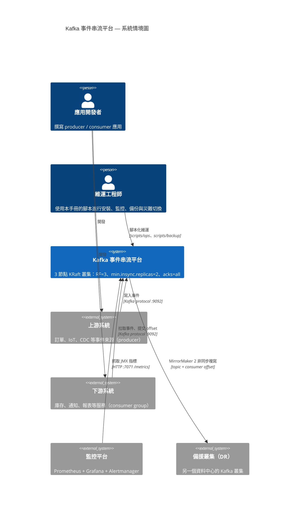
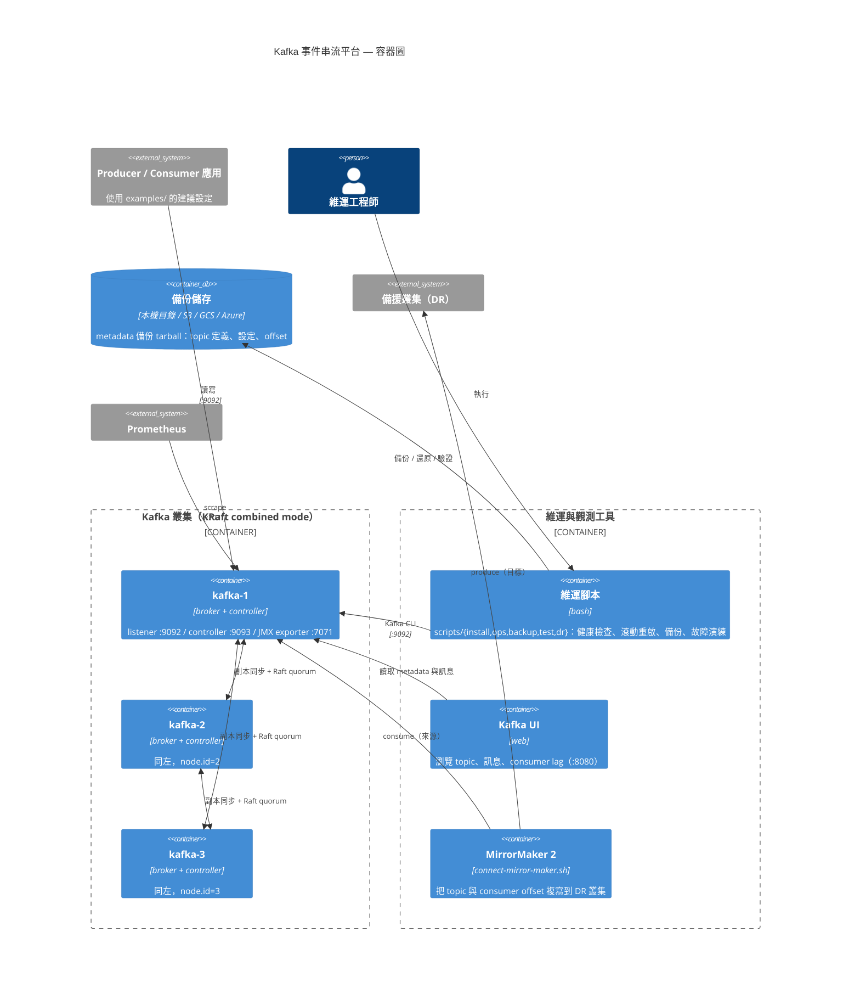
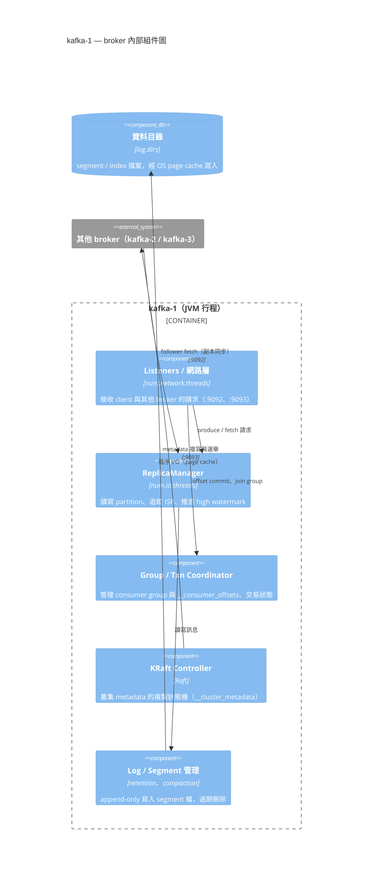

# Apache Kafka 完整手冊：規劃、設計、安裝、管理、維運、災難備援

> 一本從「完全沒碰過 Kafka」到「能獨立扛起正式環境」的實作手冊。
> 每一章都附可直接執行的腳本，所有腳本都在 Kafka 4.1.2 的真實叢集上驗證過。

---

## 目錄

**第一部：理解（初學者從這裡開始）**
1. [Kafka 到底是什麼](#1-kafka-到底是什麼)
2. [五個核心概念](#2-五個核心概念)
3. [十分鐘動手跑起來](#3-十分鐘動手跑起來)
4. [KRaft：為什麼不再需要 ZooKeeper](#4-kraft為什麼不再需要-zookeeper)

**第二部：規劃與設計**
5. [容量規劃](#5-容量規劃)
6. [叢集拓撲設計](#6-叢集拓撲設計)
7. [Topic 設計](#7-topic-設計)
8. [可靠性設計：三個旋鈕決定你會不會掉資料](#8-可靠性設計三個旋鈕決定你會不會掉資料)

**第三部：安裝與設定**
9. [安裝前準備](#9-安裝前準備)
10. [單機安裝](#10-單機安裝)
11. [多節點叢集安裝](#11-多節點叢集安裝)
12. [設定參數詳解](#12-設定參數詳解)
13. [作業系統調校](#13-作業系統調校)
14. [安全性](#14-安全性)

**第四部：管理與維運**
15. [日常管理指令](#15-日常管理指令)
16. [監控：該看哪些指標](#16-監控該看哪些指標)
17. [滾動重啟與版本升級](#17-滾動重啟與版本升級)
18. [擴充與再平衡](#18-擴充與再平衡)
19. [故障排除手冊](#19-故障排除手冊)

**第五部：備份與災難備援**
20. [先想清楚：Kafka 的「備份」是什麼](#20-先想清楚kafka-的備份是什麼)
21. [備份策略與腳本](#21-備份策略與腳本)
22. [跨叢集複寫（MirrorMaker 2）](#22-跨叢集複寫mirrormaker-2)
23. [災難切換與復原](#23-災難切換與復原)
24. [DR 演練計畫](#24-dr-演練計畫)

**附錄**
- [A. 腳本總覽](#附錄-a腳本總覽)
- [B. 測試套件](#附錄-b測試套件)
- [C. 上線檢查清單](#附錄-c上線檢查清單)
- [D. 常見錯誤訊息對照表](#附錄-d常見錯誤訊息對照表)
- [E. 本手冊的驗證環境](#附錄-e本手冊的驗證環境)
- [F. VM 佈署實戰：從裸機到通過驗證](#附錄-fvm-佈署實戰從裸機到通過驗證)

---

# 第一部：理解

## 1. Kafka 到底是什麼

### 用一句話說

**Kafka 是一個「可以重複讀取的、持久化的訊息記錄本」。**

### 用一個比喻說

想像一間銀行的交易流水帳本：

- 每一筆交易**依序寫在帳本最後一行**，寫完就不能改（append-only）
- 帳本**保存一段時間**（例如 7 天），過期的舊頁才會被撕掉
- **很多人可以同時看這本帳本**，各自用書籤記住自己看到哪一行
- 甲部門看到第 100 行，乙部門還在第 30 行，**互不影響**
- 甲部門想重看，把書籤往回移就好，**資料還在**

這就是 Kafka。和傳統訊息佇列（RabbitMQ、ActiveMQ）最大的差別是：

| | 傳統訊息佇列 | Kafka |
|---|---|---|
| 訊息被讀取後 | 從佇列中移除 | **留著**，直到過期 |
| 重複消費 | 做不到（除非重送） | 把 offset 往回調就好 |
| 多個消費者 | 通常要複製多份 | 各自記自己的 offset，讀同一份 |
| 消費者的角色 | 被動接收（push） | 主動拉取（pull），自己控制速度 |
| 主要瓶頸 | 訊息數量 | 磁碟頻寬 |

### 什麼時候該用 Kafka

**適合：**
- 事件流：使用者行為、IoT 感測器、應用程式 log
- 系統解耦：訂單系統寫進 Kafka，庫存／通知／報表各自去讀，彼此不知道對方存在
- 資料管線：把資料庫變更（CDC）送到資料倉儲、搜尋引擎、快取
- 需要「重播」：改了計算邏輯，把過去 7 天的資料重跑一次
- 高吞吐：單一叢集每秒數十萬到數百萬則訊息

**不適合：**
- 需要「依優先權插隊」→ Kafka 只有嚴格的先進先出
- 需要「查詢某一筆訊息」→ 那是資料庫的工作，Kafka 只能循序讀
- 每則訊息都很大（>10MB）→ 應該把大檔放物件儲存，Kafka 只傳連結
- 訊息量很小（每天幾千筆）而且團隊沒人懂 Kafka → 維運成本遠大於效益，用資料庫表格輪詢就好
- 需要精確的延遲排程（「30 分鐘後送出」）→ Kafka 沒有延遲佇列

> **給初學者的誠實建議**：Kafka 很強，但它是一個需要持續維運的分散式系統。
> 如果你的需求用一張資料庫表格加上定時任務就能解決，那就先那樣做。
> 等到真的遇到「吞吐不夠」或「系統之間耦合太緊」的痛點，再導入 Kafka。

---

## 2. 五個核心概念

只要理解這五個，Kafka 就懂了八成。

### 2.1 Topic（主題）

訊息的分類名稱，像資料庫的表格名稱。

```
訂單系統 ──寫入──> topic: orders
                      ↓
              庫存服務、通知服務、報表服務 各自讀取
```

### 2.2 Partition（分區）—— 最關鍵的概念

一個 topic 會被切成多個 partition。**這是 Kafka 能夠水平擴充的原因。**

```
topic: orders （3 個 partition）

partition 0: [訂單A] [訂單D] [訂單G] ──> 只保證這條線內的順序
partition 1: [訂單B] [訂單E] ──────────> 只保證這條線內的順序
partition 2: [訂單C] [訂單F] [訂單H] ──> 只保證這條線內的順序
              ↑                    ↑
            offset 0            offset 2
```

**三件必須記住的事：**

1. **順序保證只在單一 partition 內成立。** 跨 partition 沒有全域順序。
   要讓同一個使用者的事件保持順序 → 用 `user_id` 當 key，
   相同 key 會用雜湊落到同一個 partition。

2. **partition 數決定最大平行度。** 一個 partition 同時只能被同一個 consumer group
   裡的**一個** consumer 讀取。6 個 partition 最多 6 個 consumer 同時工作，
   第 7 個只能閒著。

3. **partition 只能增加，不能減少。** 而且增加會改變 key 的雜湊落點，
   讓原本有序的 key 跑到別的 partition 去。**所以要一開始就規劃好。**

### 2.3 Offset（位移）

每則訊息在 partition 內的流水號，從 0 開始，只增不減。

Consumer 記住「我讀到第幾號」，這個記錄叫做 **committed offset**，
存在 Kafka 內部的 `__consumer_offsets` topic 裡。

```
partition 0: [0][1][2][3][4][5][6][7][8][9]
                          ↑           ↑
                    committed      log end
                     offset=4       offset=10
                          └── lag = 6 ──┘
```

**Lag（落後量）= log end offset − committed offset**，
這是維運上最重要的單一數字：lag 持續增加 = consumer 追不上生產速度。

### 2.4 Replication（副本）

每個 partition 可以有多個副本，分散在不同 broker 上。

```
partition 0:  Leader（broker 1） ← 所有讀寫都走這裡
              Follower（broker 2） ← 持續複製 leader 的資料
              Follower（broker 3） ← 持續複製 leader 的資料

              ISR (In-Sync Replicas) = {1, 2, 3}
              「跟上進度的副本集合」
```

- **Leader**：負責處理該 partition 的所有讀寫
- **Follower**：不斷向 leader 拉取資料
- **ISR**：目前跟得上進度的副本集合。落後太久（`replica.lag.time.max.ms`，預設 30 秒）
  的 follower 會被踢出 ISR
- Leader 掛掉時，**從 ISR 裡選一個**當新 leader

`replication.factor=3` 表示每個 partition 有 3 份，可以容忍 2 台 broker 同時掛掉
（但要能繼續寫入，還要看 `min.insync.replicas`，見 [第 8 章](#8-可靠性設計三個旋鈕決定你會不會掉資料)）。

### 2.5 Consumer Group（消費者群組）

同一個 group 裡的 consumer **共同分擔**一個 topic 的所有 partition。

```
topic orders（6 個 partition）

group "inventory-service"（3 個 consumer）
  consumer-1 ← partition 0, 1
  consumer-2 ← partition 2, 3
  consumer-3 ← partition 4, 5

group "analytics-service"（2 個 consumer）   ← 完全獨立的一套進度
  consumer-A ← partition 0, 1, 2
  consumer-B ← partition 3, 4, 5
```

- 同一 group 內：**分工**，每個 partition 只給一個成員
- 不同 group 之間：**各讀各的**，互不影響
- 成員加入或離開時，會觸發 **rebalance**（重新分配 partition）。
  rebalance 期間該 group 會**暫停消費**，這是延遲尖峰的常見來源。

---

## 3. 十分鐘動手跑起來

先跑起來，再回頭理解。

### 3.1 前置需求

- Linux 或 macOS
- Java 17 以上（Kafka 4.x 的 broker 需要）
- 約 2 GB 記憶體、5 GB 磁碟

```bash
java -version    # 確認是 17 或更高
```

沒有 Java 的話：

```bash
# Ubuntu / Debian
sudo apt update && sudo apt install -y openjdk-21-jdk-headless

# RHEL / Rocky / Alma
sudo dnf install -y java-21-openjdk-headless

# macOS
brew install openjdk@21
```

### 3.2 取得本手冊與腳本

```bash
git clone https://github.com/ChunPingWang/kafka-tutorial.git
cd kafka-tutorial
cp conf/kafka-env.sh.example conf/kafka-env.sh   # 之後要調整路徑就改這個檔
```

### 3.3 檢查環境

```bash
./scripts/install/preflight.sh
```

會逐項檢查 Java 版本、記憶體、磁碟、檔案描述符、核心參數、port 佔用等。
**學習環境出現警告是正常的**，只要沒有 `✘` 就可以繼續。

### 3.4 安裝並啟動

```bash
./scripts/install/install-kafka.sh
```

這一步會做六件事：下載並用 SHA512 校驗、解壓縮、產生設定檔、
格式化 KRaft 儲存目錄、產生啟停腳本、啟動並等待就緒。

看到這樣就成功了：

```
==> 完成
  cluster.id : 0gg9RsEwReuOSjginwBTgQ
  設定檔     : /root/kafka/conf/server.properties
  啟動       : /root/kafka/start.sh
  停止       : /root/kafka/stop.sh
```

### 3.5 驗證

```bash
./scripts/test/smoke-test.sh
```

這會跑 14 項檢查——建立 topic、生產、消費、比對內容完整性、
驗證 key 的順序保證、檢查 ISR、動態改設定、清理。全綠才算真的裝好。

### 3.6 手動玩一次

```bash
export PATH="$HOME/kafka/current/bin:$PATH"
BS=localhost:9092

# 建立一個 3 partition 的 topic
kafka-topics.sh --bootstrap-server $BS --create --topic my-first-topic --partitions 3

# 看看它長什麼樣
kafka-topics.sh --bootstrap-server $BS --describe --topic my-first-topic

# 開一個終端機消費（會停在這裡等訊息）
kafka-console-consumer.sh --bootstrap-server $BS --topic my-first-topic --from-beginning

# 開另一個終端機生產（輸入文字後按 Enter）
kafka-console-producer.sh --bootstrap-server $BS --topic my-first-topic
> hello
> kafka
```

**試試看這幾件事，體會前面講的概念：**

```bash
# 1. 帶 key 生產，觀察相同 key 是否落在同一個 partition
kafka-console-producer.sh --bootstrap-server $BS --topic my-first-topic \
  --property parse.key=true --property key.separator=:
> user1:登入
> user2:登入
> user1:下單

# 用 consumer 印出 partition 確認
kafka-console-consumer.sh --bootstrap-server $BS --topic my-first-topic \
  --from-beginning --property print.key=true --property print.partition=true

# 2. 用同一個 group 開兩個 consumer，看 partition 怎麼分配
kafka-console-consumer.sh --bootstrap-server $BS --topic my-first-topic --group g1
# （另一個終端機）
kafka-console-consumer.sh --bootstrap-server $BS --topic my-first-topic --group g1

# 3. 看 lag
kafka-consumer-groups.sh --bootstrap-server $BS --describe --group g1

# 4. 把 offset 倒回最開頭，重新消費一次（consumer 要先全部停掉）
kafka-consumer-groups.sh --bootstrap-server $BS --group g1 \
  --topic my-first-topic --reset-offsets --to-earliest --execute
```

### 3.7 想要多節點環境？

單機叢集看不到副本、ISR、leader 選舉這些最重要的行為。用 Docker 開一個三節點叢集：

```bash
docker compose -f docker/docker-compose.yml up -d
BOOTSTRAP_SERVERS=localhost:19092 ./scripts/test/smoke-test.sh

# 圖形化介面
open http://localhost:8080
```

不想用 Docker 也可以在同一台機器上跑三個 broker，見 [第 11 章](#11-多節點叢集安裝)。

### 3.8 停止與清除

```bash
~/kafka/stop.sh                  # 停止
rm -rf ~/kafka                   # 完全移除（會刪掉所有資料）
```

---

## 4. KRaft：為什麼不再需要 ZooKeeper

如果你看過舊教學，會發現到處都在講 ZooKeeper。**從 Kafka 4.0 開始，ZooKeeper 已經完全移除。**
本手冊只講 KRaft。

### 差在哪裡

**以前（Kafka 3.x 以前）：**
```
ZooKeeper 叢集（3 台）  ← 存放 metadata：有哪些 topic、partition 在哪、誰是 leader
        ↕
Kafka 叢集（3 台）      ← 存放實際訊息
```
要維護兩套分散式系統、兩套監控、兩套備份。

**現在（KRaft）：**
```
Kafka 叢集（3 台）  ← metadata 和訊息都在這裡
                      metadata 存在一個內部的 __cluster_metadata topic，
                      用 Raft 協議在 controller 之間達成共識
```

好處很實際：少一套系統要顧、controller 故障切換從數十秒縮短到秒級、
支援的 partition 數量大幅提升（百萬級）。

### 兩種角色

在 KRaft 模式下，每個節點透過 `process.roles` 宣告自己的角色：

| 角色 | 說明 | 什麼時候用 |
|---|---|---|
| `controller` | 只管 metadata，參與 Raft 投票 | 大型叢集（>10 broker），專用 3 台 |
| `broker` | 只管資料 | 大型叢集的資料節點 |
| `broker,controller` | 兩者兼任（combined mode） | 開發環境、中小型叢集（≤ 10 節點） |

**Controller 的數量必須是奇數**（1、3、5），因為 Raft 靠多數決：

| controller 數 | 可容忍故障數 | 適用 |
|---|---|---|
| 1 | 0 | 只有開發環境 |
| 3 | 1 | 大多數正式環境 |
| 5 | 2 | 對可用性要求極高 |

> 超過 5 個 controller 不會更可靠，反而因為要更多節點達成共識而變慢。

### 幾個你會遇到的名詞

- **cluster.id**：叢集的唯一識別碼，格式化時產生。
  **同一個叢集的所有節點必須用同一個 cluster.id**，不然節點會拒絕加入。
- **kafka-storage.sh format**：KRaft 的必要步驟。
  它會在 `log.dirs` 建立 `meta.properties`，寫入 cluster.id 與 node.id。
  沒格式化就啟動會直接失敗。
- **controller.quorum.voters**：controller 成員清單，格式 `<node.id>@<host>:<port>`。
- **metadata log**：所有 metadata 變更的 Raft log，存在 `log.dirs` 下的 `__cluster_metadata-0`。

查看 quorum 狀態：

```bash
kafka-metadata-quorum.sh --bootstrap-server localhost:9092 describe --status
```

```
ClusterId:              ZP4ZZdWKR7KqTQ3V6U1QqQ
LeaderId:               1                        ← 目前的 controller leader
LeaderEpoch:            1
HighWatermark:          63
MaxFollowerLag:         0                        ← follower 落後量，應該接近 0
CurrentVoters:          [{"id": 1, ...}, {"id": 2, ...}, {"id": 3, ...}]
CurrentObservers:       []
```

`MaxFollowerLag` 持續偏大，代表 controller 之間的網路或磁碟有問題，要立刻查。

---
# 第二部：規劃與設計

> 這一部的每個決定都很難事後修改。花一天想清楚，可以省掉半年的痛苦。

## 5. 容量規劃

### 5.1 先問清楚五個數字

在算任何東西之前，先去問業務單位這五個問題：

| # | 問題 | 為什麼重要 |
|---|---|---|
| 1 | 尖峰每秒幾則訊息？ | 決定 partition 數與 broker 數 |
| 2 | 平均一則多大？ | 決定磁碟與網路頻寬 |
| 3 | 要保留幾天？ | 直接決定磁碟容量 |
| 4 | 幾組下游要讀？ | 決定對外網路頻寬（每多一組就多一份讀取流量） |
| 5 | 可以掉資料嗎？可以停多久？ | 決定 RF、min.insync.replicas、DR 架構 |

**尖峰不是平均。** 電商的雙十一、金融的開盤、遊戲的改版日，
尖峰常常是平均的 5–20 倍。請用尖峰值規劃，再乘上成長預留。

### 5.2 磁碟容量公式

```
每日資料量 = 每秒訊息數 × 平均訊息大小 × 86400
所需磁碟   = 每日資料量 × 保留天數 × 副本數 ÷ 壓縮率 ÷ 目標使用率
```

**實際算一遍**（每秒 5,000 則、每則 2 KB、保留 7 天、RF=3、zstd 壓縮約 4 倍、目標使用率 60%）：

```
每日資料量 = 5,000 × 2 KB × 86,400        = 864 GB/日
七天原始   = 864 GB × 7                    = 6.05 TB
乘上副本   = 6.05 TB × 3                   = 18.1 TB
除以壓縮   = 18.1 TB ÷ 4                   = 4.5 TB
除以使用率 = 4.5 TB ÷ 0.6                  = 7.5 TB

→ 3 台 broker，每台約 2.5 TB 可用空間
```

**為什麼要留 40% 空白？**

1. Kafka 磁碟寫滿 = broker 直接停止服務，而且很難救
2. Segment 要等寫滿或超時才會輪替，之後才可能被刪除，實際用量會高於理論值
3. Partition 重新分配時，資料會同時存在於新舊位置
4. 突發流量需要緩衝空間

### 5.3 Partition 數怎麼決定

這是最常被問、也最常設錯的參數。

```
partition 數 = max(
    目標吞吐 ÷ 單一 partition 的寫入吞吐,
    目標吞吐 ÷ 單一 consumer 的處理吞吐,
    預期的最大 consumer 數量
)
```

**實務起手式：**

| 情境 | 建議 partition 數 |
|---|---|
| 低流量（< 1 MB/s） | 3–6 |
| 中流量（1–50 MB/s） | 12–24 |
| 高流量（> 50 MB/s） | 用上面的公式算，通常 24–100 |
| 需要嚴格 key 順序 | 取「未來最大 consumer 數」，一次設到位 |

**partition 太多的代價**（不是越多越好）：
- 每個 partition 在每個 broker 上至少佔用 2 個檔案描述符
- 每個 partition 都需要記憶體 buffer；partition 過多會吃掉本該給 page cache 的記憶體
- Broker 故障時，controller 要為每個 partition 做 leader 選舉，恢復時間變長
- 端到端延遲會微幅上升

**單一叢集的合理上限**：KRaft 模式可支援到百萬級 partition，
但實務上建議每台 broker 不超過 2,000–4,000 個 partition（含副本）。

**最重要的一句話：partition 只能增加，不能減少，而且增加會打亂 key 的雜湊落點。**
規劃時請預留 2–3 倍的成長空間。

### 5.4 Broker 數量與規格

**數量：**

| 需求 | broker 數 |
|---|---|
| 開發／測試 | 1 |
| 正式環境最低 | 3（RF=3 的最低要求） |
| 可容忍 2 台同時故障 | 5 |
| 大流量 | 依吞吐計算，通常 6–12 |

**單機規格建議：**

| 資源 | 建議 | 理由 |
|---|---|---|
| CPU | 12–24 核 | 壓縮、TLS、副本同步吃 CPU |
| 記憶體 | 64 GB（heap 只給 6–8 GB） | **其餘全部留給 OS page cache** |
| 磁碟 | NVMe SSD 或多顆 SATA SSD，JBOD | 循序寫入為主，IOPS 需求不高但頻寬要夠 |
| 網路 | 10 GbE 以上 | RF=3 時，1 份寫入 = 3 份網路流量 |

> **記憶體配置最常見的錯誤**：把 heap 設成 32 GB 甚至更大。
> Kafka 幾乎不在 heap 裡放資料，它靠 OS page cache 服務讀取。
> heap 給 6–8 GB 就非常夠用，剩下的記憶體留給作業系統，讀取效能會好很多。
> heap 太大還會讓 GC 停頓變長，直接反映在 p99 延遲上。

### 5.5 網路頻寬

**這是最容易被低估的資源。**

```
入向流量 = 生產速率
內部流量 = 生產速率 × (RF − 1)          ← 副本同步
出向流量 = 生產速率 × 消費者群組數量
```

以每秒 100 MB 的生產速率、RF=3、4 組 consumer 為例：

```
入向 = 100 MB/s
內部 = 100 × 2 = 200 MB/s
出向 = 100 × 4 = 400 MB/s
總計 = 700 MB/s = 5.6 Gbps
```

**1 GbE（約 125 MB/s）在這個情境下完全不夠。** 這也是為什麼正式環境建議 10 GbE。

### 5.6 用實測驗證你的估算

紙上談兵不準，用真實硬體跑一次：

```bash
./scripts/test/perf-test.sh --records 1000000 --size 2048 --partitions 12
```

會輸出這樣一張表（以下為本手冊驗證環境的實際數據）：

```
scenario          acks  linger_ms  batch_size  compression  throughput_rec_s  throughput_mb_s  avg_latency_ms  p99_ms
acks0-最快        0     0          16384       none         19029.5           18.58            323.33          392
acks1-折衷        1     0          16384       none         20345.9           19.87            178.78          301
acksAll-最安全    all   0          16384       none         23894.9           23.33            68.33           175
acksAll-批次調校  all   20         131072      none         31496.1           30.76            13.41           35
acksAll-lz4壓縮   all   20         131072      lz4          27173.9           26.54            27.17           69
acksAll-zstd壓縮  all   20         131072      zstd         26631.2           26.01            26.94           69
```

**怎麼讀這張表：**
- 用 `acksAll-批次調校`（也就是你正式環境的設定）那一列的 MB/s **除以 2** 當作安全水位
- `acks=0` 到 `acks=all` 的吞吐落差是「可靠性的價格」。若落差超過 50%，
  通常代表副本同步是瓶頸——檢查網路頻寬與磁碟
- **p99 才是使用者的感受**，平均值會騙人
- 上表中 `linger.ms=20` + 大 batch 反而讓延遲**下降**，這是因為批次減少了請求數量，
  排隊變短。這說明「調大批次一定會增加延遲」是個常見誤解

---

## 6. 叢集拓撲設計

### 6.1 節點角色配置

**中小型（≤ 10 節點）—— combined mode**

```
kafka-1: process.roles=broker,controller   node.id=1
kafka-2: process.roles=broker,controller   node.id=2
kafka-3: process.roles=broker,controller   node.id=3
```
簡單、省機器。缺點是 controller 和 broker 搶資源。

**大型（> 10 節點）—— 角色分離**

```
controller-1..3: process.roles=controller    ← 小機器就夠（4 核 / 8 GB）
broker-1..N:     process.roles=broker        ← 大機器
```
好處：controller 不受資料流量影響，metadata 操作更穩定；
broker 可以隨意增減，不影響 quorum。

### 6.2 機架感知（rack awareness）

**如果你的機器分布在多個機架或可用區，這是必設的參數。**

```properties
# 每台 broker 設定自己所在的機架／可用區
broker.rack=az-a
```

設定之後，Kafka 建立 partition 時會**盡量把副本分散到不同機架**。
沒設的話，三個副本可能全在同一個機架，機架斷電就全滅。

驗證是否生效：

```bash
kafka-topics.sh --bootstrap-server $BS --describe --topic my-topic
# 檢查 Replicas 的 broker id 是否來自不同機架
```

### 6.3 多可用區部署

**推薦：三個 AZ，各放一台**

```
AZ-A: kafka-1 (broker.rack=az-a)
AZ-B: kafka-2 (broker.rack=az-b)
AZ-C: kafka-3 (broker.rack=az-c)

RF=3, min.insync.replicas=2
→ 整個 AZ 掛掉仍可讀寫
```

**代價**：跨 AZ 的副本同步會產生流量費用與額外延遲（通常 1–3 ms）。
若延遲敏感，可以讓 consumer 用 `client.rack` 就近讀取 follower：

```properties
# broker 端
replica.selector.class=org.apache.kafka.common.replica.RackAwareReplicaSelector
# consumer 端
client.rack=az-a
```

**不推薦：兩個 AZ。** 兩個 AZ 無法形成穩定的 quorum——
掛掉任一邊都可能失去多數決。要嘛三個 AZ，要嘛單 AZ 加跨區 DR。

### 6.4 什麼時候該用多個叢集

不要把所有東西塞進同一個叢集。以下情況應該分開：

| 情況 | 理由 |
|---|---|
| 不同的可靠性等級 | 金流不該和 log 搶資源 |
| 不同的合規要求 | 個資與非個資分開，稽核範圍才好界定 |
| 跨地域 | 跨洲的副本同步延遲不可接受，應該用 MM2 複寫 |
| 單叢集超過 ~15 台 | 維運複雜度上升快，考慮拆分 |

### 6.5 C4 模型：Kafka 與周邊組件的關係

拓撲設計的最後一步，是把「Kafka 本身」和「圍繞它的一切」畫在同一張圖上。
下面用 [C4 Model](https://c4model.com/) 的前三層描述本手冊建立的完整系統——
你交給主管或新同事的架構說明，基本上就是這三張圖。

#### Level 1：系統情境圖（System Context）

先回答「誰在用 Kafka、Kafka 又依賴誰」。



讀圖重點：

- **事件的流向只有一種**：上游寫入、下游拉取，兩者透過 Kafka 完全解耦，互相不知道對方存在（第 1 章的核心價值）。
- **監控是拉（pull）模式**：Prometheus 主動來抓 :7071，broker 不需要對外推送任何東西。
- **DR 複寫是非同步的**：主叢集掛掉的瞬間，尚未複寫的訊息就是你的 RPO（第 22–24 章）。

#### Level 2：容器圖（Container）

放大「Kafka 事件串流平台」這個框，看看裡面有哪些會獨立執行的東西。
這張圖同時就是 `docker/docker-compose.yml` 練習環境與正式環境的對照。



讀圖重點：

- **三台 broker 彼此對等**：每一台都同時是 broker（存資料）和 controller quorum 的投票者（第 4 章）。
  圖上畫到 kafka-1 的連線，實際上對三台都成立——client 會自己找到每個 partition 的 leader。
- **MirrorMaker 2 是獨立行程**，不是 broker 的一部分。它本質上是「一個 consumer 加一個 producer」，
  掛掉不影響主叢集，只影響 RPO。
- **備份儲存的內容是 metadata**（topic 定義、設定、offset），不是訊息本體——
  訊息本體的「備份」靠的是 RF=3 與 MM2 複寫（第 20 章的核心觀念）。

#### Level 3：組件圖（Component）—— 單一 broker 內部

最後放大一台 broker。日常維運不需要記住這張圖，
但在讀第 16 章的監控指標與第 19 章的故障排除時，它能幫你把指標對應到位置。



讀圖重點（對應監控章節）：

| 組件 | 出問題時的症狀 | 對應指標（第 16 章） |
|---|---|---|
| 網路層 | 請求排隊、延遲上升 | `NetworkProcessorAvgIdlePercent` |
| ReplicaManager | ISR 縮減、URP > 0 | `UnderReplicatedPartitions`、`IsrShrinksPerSec` |
| KRaft Controller | 選不出 leader、metadata 操作卡住 | `current-state`、quorum lag |
| Log / 磁碟 | 寫入變慢、磁碟寫滿直接停止服務 | log size、磁碟使用率 |

> **提醒**：C4 圖是「溝通工具」，不是「維護負擔」。
> 拓撲改變時（加 broker、加叢集、換監控），記得回來改這三張圖——
> 一張過時的架構圖比沒有圖更危險。

---

## 7. Topic 設計

### 7.1 命名規範

一致的命名讓權限管理與監控變得容易。建議格式：

```
<領域>.<實體>.<事件類型>[.<版本>]

範例：
  orders.order.created
  orders.order.cancelled
  payments.transaction.settled.v2
  inventory.stock.changed
```

**規則：**
- 只用小寫、數字、`.`、`-`、`_`（Kafka 允許的字元）
- **`.` 和 `_` 擇一，而且整個叢集要一致**：Kafka 的指標名稱會把 `.` 與 `_` 視為
  可能衝突（`a.b` 和 `a_b` 會映射到同一個指標名），因此建立含這兩種字元的 topic 時
  一定會跳出警告。警告本身不影響功能，但同時存在 `orders.created` 與 `orders_created`
  會讓監控指標互相覆蓋
- 長度上限 249 字元，但實務上不要超過 60
- 環境用「不同叢集」區隔，不要用 `prod-` 前綴混在同一個叢集裡

### 7.2 Retention（保留策略）

**兩種清理方式，用途完全不同：**

**`cleanup.policy=delete`（預設）—— 依時間或大小刪除**

```bash
./scripts/ops/topic-admin.sh set-config orders.order.created \
  retention.ms=604800000 \
  retention.bytes=-1
```

| 資料性質 | 建議保留 |
|---|---|
| 即時處理，下游都跟得上 | 1–3 天 |
| 一般業務事件 | 7 天（讓週末故障有時間處理） |
| 需要重播分析 | 30 天 |
| 稽核用途 | 依法規；超過 90 天建議另外歸檔到物件儲存 |

**`cleanup.policy=compact` —— 只保留每個 key 的最新值**

```bash
./scripts/ops/topic-admin.sh set-config user.profile.snapshot \
  cleanup.policy=compact \
  min.cleanable.dirty.ratio=0.5 \
  delete.retention.ms=86400000
```

適合「目前狀態」類的資料：使用者設定檔、商品目前價格、裝置最新狀態。
compaction 保證每個 key 的最新值永遠在，可以用來重建狀態。

> **重要**：compaction 是**背景非同步**進行的，不保證立即生效。
> 剛寫入的舊版本可能還在，consumer 必須能容忍讀到同一個 key 的多個版本。

### 7.3 Key 的選擇

**這是設計 topic 時最重要的決定。**

| Key | 效果 | 適用 |
|---|---|---|
| `null`（不設） | 輪流分散到各 partition，負載最均勻 | 不需要順序保證的 log、指標 |
| `user_id` | 同一使用者的事件保持順序 | 使用者行為追蹤 |
| `order_id` | 同一訂單的狀態變化保持順序 | 訂單生命週期 |
| `tenant_id` | 同一租戶的資料集中 | 多租戶系統 |

**要小心資料傾斜（hot partition）。** 如果用 `tenant_id` 當 key 而某個大客戶
佔了 80% 的流量，那個 partition 就會成為瓶頸。此時可以改用
`tenant_id + 隨機後綴` 分散，代價是失去該租戶的全域順序。

檢查是否傾斜：

```bash
./scripts/ops/topic-admin.sh biggest 10
```

### 7.4 訊息格式與 Schema

**不要用純 JSON 字串當長期格式。** 沒有 schema 的下場是：
上游改了欄位名稱，下游三個月後才在半夜爆炸。

| 格式 | 優點 | 缺點 |
|---|---|---|
| JSON | 人看得懂、好除錯 | 體積大、沒有 schema 約束 |
| Avro + Schema Registry | 體積小、強制相容性檢查 | 需要額外元件 |
| Protobuf | 體積小、跨語言支援好 | 需要編譯步驟 |

**至少要做到**：在訊息裡放一個 `schema_version` 欄位，
並且約定「只能新增選填欄位，不能刪除或改名既有欄位」（向後相容）。

### 7.5 Topic 建立範例

```bash
# 金流訂單：高可靠性
./scripts/ops/topic-admin.sh create payments.transaction.settled \
  -p 12 -r 3 \
  -c min.insync.replicas=2 \
  -c retention.ms=2592000000 \
  -c compression.type=zstd \
  -c unclean.leader.election.enable=false

# 應用程式 log：高吞吐、可容忍少量遺失
./scripts/ops/topic-admin.sh create platform.app.logs \
  -p 24 -r 2 \
  -c min.insync.replicas=1 \
  -c retention.ms=259200000 \
  -c compression.type=lz4

# 狀態快照：compaction
./scripts/ops/topic-admin.sh create catalog.product.state \
  -p 6 -r 3 \
  -c cleanup.policy=compact \
  -c min.insync.replicas=2
```

---

## 8. 可靠性設計：三個旋鈕決定你會不會掉資料

**如果這份手冊你只讀一節，就讀這一節。**

### 8.1 三個旋鈕

```
┌─ producer 端 ──┐   ┌──── broker 端 ────┐
│                │   │                    │
│  acks          │   │ replication.factor │
│                │   │ min.insync.replicas│
└────────────────┘   └────────────────────┘
```

**旋鈕 1：`acks`（producer）**

| 值 | 意思 | 什麼時候會掉資料 |
|---|---|---|
| `0` | 送出就不管了 | 網路丟包、broker 拒收——**而且你不會知道** |
| `1` | leader 寫入就回 ack | leader 在 follower 複製完成前掛掉 |
| `all` | 所有 in-sync 副本都寫入才回 ack | 幾乎不會（除非 unclean election） |

**旋鈕 2：`replication.factor`（topic）** —— 一共存幾份

**旋鈕 3：`min.insync.replicas`（topic/broker）** —— `acks=all` 時至少要幾份成功

### 8.2 黃金組合

```
replication.factor  = 3
min.insync.replicas = 2
acks                = all
unclean.leader.election.enable = false
```

**為什麼是 3 和 2？**

- RF=3：可以掉 2 台還保有資料
- min.isr=2：只要還有 2 個副本活著就能繼續寫入 → **掉 1 台仍可正常服務**
- 掉 2 台時：只剩 1 個副本，寫入會被拒絕（保護資料），但讀取仍正常
- 這是「可用性」與「不掉資料」之間最實用的平衡點

**常見錯誤：RF=3 但 min.isr=3。** 這樣掉任何一台就完全停寫，
可用性反而比 RF=2 還差。**`min.insync.replicas` 一定要小於 `replication.factor`。**

> 完整、逐行註解的 client 設定範例在 `examples/producer-config.properties`
> 與 `examples/consumer-config.properties`——可直接接在 `kafka-console-producer.sh
> --producer.config` / `kafka-console-consumer.sh --consumer.config` 使用，
> 也是應用程式設定的起點。

### 8.3 `unclean.leader.election.enable` 一定要是 false

```properties
unclean.leader.election.enable=false
```

設成 `true` 的意思是：「所有 in-sync 副本都掛了的時候，
允許一個**落後的**副本當上 leader。」

後果：那個副本沒有的訊息，**永久消失**，而且沒有任何錯誤訊息。
你只會在某天對帳時發現數字對不上。

**寧可停止服務，也不要靜默地遺失資料。** 保持 `false`。

### 8.4 實測：這些設定真的有效嗎

不要相信文件，自己驗證。本手冊的故障注入測試會實際停掉一台 broker：

```bash
./scripts/test/resilience-test.sh --docker kafka-2
```

以下是在真實三節點叢集（RF=3, min.insync.replicas=2）上的實測結果：

```
==> 測試 2：停掉一個 broker 之後
  ✔ 叢集偵測到 broker 離線（存活 2/3）
  ✔ 如預期出現 56 個 under-replicated partition
  ✔ 少一台 broker，acks=all 仍可寫入（RF=3 > min.isr=2 的價值）
  ✔ 少一台 broker，consumer 仍可讀取

==> 測試 3：min.insync.replicas 的保護作用
  ✔ min.insync.replicas=3 但只有 2 個副本時，acks=all 的資料讀不到
  ✔ acks=1 在 ISR 不足時，訊息同樣無法被消費（high watermark 不前進）

==> 測試 4：ISR 恢復後，被擋住的訊息會怎樣
  ✔ broker 復原後 7 秒內所有副本追平
      ISR 恢復後浮現 200 筆先前不可見的訊息
```

**這裡有兩個值得記住的行為：**

1. **在 Kafka 4.x，ISR 低於 `min.insync.replicas` 時，`acks=1` 的訊息也讀不到。**
   訊息可能已經寫進 leader 的 log，但 high watermark 不會前進，
   所以 consumer 看不到。這和舊版本「acks=1 照寫不誤」的行為不同。

2. **ISR 恢復後，那些訊息會一次浮現。**
   維運上的意義很重要：ISR 不足期間看到的「訊息不見了」**不一定是真的遺失**。
   請先讓副本追上再判斷，不要急著重送而造成重複資料。

### 8.5 端到端的 exactly-once

「恰好一次」需要 producer、broker、consumer 三邊配合：

**Producer 端 —— 冪等性 + 交易**
```properties
enable.idempotence=true          # Kafka 3.0 起預設為 true
acks=all                         # 冪等性要求
max.in.flight.requests.per.connection=5
transactional.id=my-service-1    # 需要跨 partition 原子寫入時
```

**Consumer 端 —— 只讀已提交的交易**
```properties
isolation.level=read_committed
enable.auto.commit=false         # 改成處理成功後才手動 commit
```

**但更務實的做法是「至少一次 + 下游冪等」：**

交易會犧牲吞吐（通常 20–30%）並增加複雜度。
大多數情況下，讓下游處理有冪等性（例如用訊息 ID 做去重、
或用 `INSERT ... ON CONFLICT DO NOTHING`）更簡單也更可靠。

### 8.6 可靠性設定速查表

| 資料類型 | RF | min.isr | acks | 冪等 | 保留 |
|---|---|---|---|---|---|
| 金流、訂單 | 3 | 2 | all | ✔ | 30 天 |
| 一般業務事件 | 3 | 2 | all | ✔ | 7 天 |
| 使用者行為追蹤 | 3 | 2 | 1 | ✘ | 7 天 |
| 應用程式 log | 2 | 1 | 1 | ✘ | 3 天 |
| 指標、監控 | 2 | 1 | 0 | ✘ | 1 天 |
| 開發測試 | 1 | 1 | 1 | ✘ | 1 天 |

---
# 第三部：安裝與設定

## 9. 安裝前準備

### 9.1 執行前置檢查

```bash
./scripts/install/preflight.sh                # 學習環境
STRICT=true ./scripts/install/preflight.sh    # 正式環境（警告也視為失敗）
```

檢查九大類：作業系統、Java、記憶體、磁碟、ulimit、port、核心參數、時間同步、必要工具。

### 9.2 手動檢查清單

| 項目 | 要求 | 怎麼檢查 |
|---|---|---|
| Java | 17 以上 | `java -version` |
| 磁碟檔案系統 | XFS 或 ext4，**絕對不要 NFS** | `df -T /data` |
| 磁碟掛載選項 | 加上 `noatime` | `mount \| grep /data` |
| 時間同步 | NTP 已同步 | `timedatectl` |
| 主機名稱解析 | 每台 broker 都能互相解析 | `getent hosts kafka-2` |
| 防火牆 | 9092（client）、9093（controller）互通 | `nc -zv kafka-2 9093` |
| 服務帳號 | 專用的 `kafka` 使用者，不要用 root | `id kafka` |

### 9.3 磁碟規劃

```
/                    50 GB    系統
/opt/kafka          20 GB    程式本體（多版本並存用）
/var/log/kafka      50 GB    broker 自己的 log（不是訊息資料！）
/data/kafka-1      2.5 TB    訊息資料（log.dirs）
/data/kafka-2      2.5 TB    多顆磁碟時分開掛載
```

**兩個常見錯誤：**

1. **把 `log.dirs`（訊息資料）和 `LOG_DIR`（broker 的 log4j 輸出）搞混。**
   前者是資料，後者是應用程式日誌，兩者名字很像但完全不同。

2. **用 RAID 5/6。** Kafka 已經靠 replication 做冗餘，
   RAID 5/6 的寫入懲罰會拖垮效能。用 **JBOD**（多個獨立磁碟，
   在 `log.dirs` 用逗號列出）或 RAID 10。

### 9.4 建立服務帳號與目錄

```bash
sudo useradd --system --home-dir /opt/kafka --shell /sbin/nologin kafka
sudo mkdir -p /opt/kafka /var/log/kafka /data/kafka-1
sudo chown -R kafka:kafka /opt/kafka /var/log/kafka /data/kafka-1
```

---

## 10. 單機安裝

適合學習與開發。

```bash
cp conf/kafka-env.sh.example conf/kafka-env.sh
# 依需要編輯 conf/kafka-env.sh
./scripts/install/install-kafka.sh
./scripts/test/smoke-test.sh
```

### 常用選項

```bash
# 指定版本
./scripts/install/install-kafka.sh --version 4.3.1

# 只安裝不啟動
./scripts/install/install-kafka.sh --no-start

# 換 port（同一台要跑多個 broker 時）
./scripts/install/install-kafka.sh \
  --broker-port 9192 --controller-port 9193 --jmx-port 9199

# 預演，只看會做什麼
DRY_RUN=true ./scripts/install/install-kafka.sh
```

### 安裝後的目錄結構

```
~/kafka/
├── current -> kafka_2.13-4.1.2/   # symlink，升級只要改這裡
├── kafka_2.13-4.1.2/              # 程式本體
├── conf/
│   ├── server.properties          # broker 設定
│   └── cluster-info               # cluster.id 等資訊（備份時會用到）
├── data/                          # log.dirs：訊息資料
│   ├── meta.properties            # KRaft 的 cluster.id / node.id
│   └── __cluster_metadata-0/      # metadata Raft log
├── logs/                          # broker 自己的 log
├── downloads/                     # 下載的 tarball
├── start.sh / stop.sh
└── kafka.pid
```

> `current` 這個 symlink 是刻意設計的：升級時只要把它指向新版本目錄，
> 出問題時指回舊版本，回退只要幾秒鐘。

---

## 11. 多節點叢集安裝

### 11.1 規劃

以三節點 combined mode 為例：

| 主機 | node.id | broker port | controller port |
|---|---|---|---|
| kafka-1.internal | 1 | 9092 | 9093 |
| kafka-2.internal | 2 | 9092 | 9093 |
| kafka-3.internal | 3 | 9092 | 9093 |

```
CONTROLLER_QUORUM_VOTERS="1@kafka-1.internal:9093,2@kafka-2.internal:9093,3@kafka-3.internal:9093"
```

### 11.2 步驟

**步驟 1：在第一台產生 cluster.id**

```bash
# 在 kafka-1 上
./scripts/install/install-kafka.sh --mode cluster --node-id 1 \
  --voters "1@kafka-1.internal:9093,2@kafka-2.internal:9093,3@kafka-3.internal:9093" \
  --advertised-host kafka-1.internal \
  --no-start

grep CLUSTER_ID ~/kafka/conf/cluster-info
# CLUSTER_ID=ZP4ZZdWKR7KqTQ3V6U1QqQ    ← 記下這個值
```

**步驟 2：其餘節點使用「同一個」cluster.id**

```bash
# 在 kafka-2 上
./scripts/install/install-kafka.sh --mode cluster --node-id 2 \
  --voters "1@kafka-1.internal:9093,2@kafka-2.internal:9093,3@kafka-3.internal:9093" \
  --advertised-host kafka-2.internal \
  --cluster-id ZP4ZZdWKR7KqTQ3V6U1QqQ \
  --no-start

# kafka-3 同理，--node-id 3
```

**步驟 3：依序啟動並驗證**

```bash
# 每台都執行
~/kafka/start.sh &

# 任一台上驗證
kafka-metadata-quorum.sh --bootstrap-server kafka-1.internal:9092 describe --status
BOOTSTRAP_SERVERS=kafka-1.internal:9092 ./scripts/test/smoke-test.sh
```

### 11.3 在同一台機器上跑三個 broker（本機練習用）

想在筆電上體驗多節點行為，但不想用 Docker：

```bash
CID=$(~/kafka/current/bin/kafka-storage.sh random-uuid)
VOTERS="1@localhost:9193,2@localhost:9293,3@localhost:9393"

for n in 1 2 3; do
  KAFKA_BASE_DIR=$HOME/kc$n \
  KAFKA_HEAP_OPTS="-Xmx768M -Xms768M" \
  ./scripts/install/install-kafka.sh --mode cluster --node-id $n \
    --voters "$VOTERS" --cluster-id "$CID" \
    --broker-port 9${n}92 --controller-port 9${n}93 --jmx-port 9${n}99 \
    --no-start
  ( cd $HOME/kc$n && nohup ./start.sh > logs/kafka-stdout.log 2>&1 & )
done

# 驗證
export BOOTSTRAP_SERVERS=localhost:9192,localhost:9292,localhost:9392
export KAFKA_HOME=$HOME/kc1/current KAFKA_BASE_DIR=$HOME/kc1
./scripts/test/smoke-test.sh
```

> `--jmx-port` 一定要錯開，否則第二個 broker 會因為
> `java.net.BindException: Address already in use` 啟動失敗。

**同機多 broker 的一個陷阱**：Kafka 內建的 `kafka-server-stop.sh` 是用
pattern 比對殺掉本機**所有** `kafka.Kafka` 行程。
本手冊產生的 `stop.sh` 改成優先用 pid 檔、其次用設定檔路徑精準反查，
就是為了避免這個誤殺。

### 11.4 用 Docker Compose

```bash
docker compose -f docker/docker-compose.yml up -d
BOOTSTRAP_SERVERS=localhost:19092 ./scripts/test/smoke-test.sh
open http://localhost:8080         # Kafka UI
```

`docker/docker-compose.yml` 刻意用了正式環境的設定
（RF=3、min.insync.replicas=2、關閉自動建立 topic），
讓你在本機就能練到副本、ISR、leader 選舉。

### 11.5 用 systemd 管理（正式環境）

```bash
sed -e 's|@@KAFKA_HOME@@|/opt/kafka/current|g' \
    -e 's|@@KAFKA_CONF@@|/opt/kafka/conf/server.properties|g' \
    -e 's|@@KAFKA_LOG_DIR@@|/var/log/kafka|g' \
    -e 's|@@KAFKA_USER@@|kafka|g' \
    -e 's|@@HEAP@@|-Xmx6G -Xms6G|g' \
    conf/templates/kafka.service.tmpl | sudo tee /etc/systemd/system/kafka.service

sudo systemctl daemon-reload
sudo systemctl enable --now kafka
sudo systemctl status kafka
```

**unit 檔裡最重要的三行：**

```ini
KillSignal=SIGTERM
TimeoutStopSec=300
SendSIGKILL=no
```

Kafka 關機時要把 leader 交接出去、把 log 索引寫完整，這需要時間。
`TimeoutStopSec` 設太短會變成 SIGKILL，下次啟動就得做冗長的 log recovery
（大型 broker 可能要好幾十分鐘）。

---

## 12. 設定參數詳解

以下是 `conf/templates/server.properties.tmpl` 裡每個參數的意義。

### 12.1 節點身分

```properties
process.roles=broker,controller      # 角色，見第 4 章
node.id=1                            # 叢集內唯一，格式化後不可改
controller.quorum.voters=1@kafka-1:9093,2@kafka-2:9093,3@kafka-3:9093
```

### 12.2 網路監聽 —— 最容易設錯的地方

```properties
listeners=PLAINTEXT://:9092,CONTROLLER://:9093
advertised.listeners=PLAINTEXT://kafka-1.internal:9092
controller.listener.names=CONTROLLER
listener.security.protocol.map=CONTROLLER:PLAINTEXT,PLAINTEXT:PLAINTEXT
inter.broker.listener.name=PLAINTEXT
```

**`listeners` vs `advertised.listeners` 的差別是新手最大的坑：**

- `listeners`：broker 實際綁定的位址
- `advertised.listeners`：**告訴 client「你應該連到哪裡」**

流程是這樣的：
1. Client 連到 `bootstrap.servers` 拿 metadata
2. Broker 回傳 `advertised.listeners` 的值
3. **Client 之後就用那個位址連線**

所以在 Docker、K8s、NAT 環境中，如果 `advertised.listeners` 設成
容器內部的名稱，外面的 client 拿到之後就連不上了——
**症狀是「bootstrap 連得上，但一開始讀寫就 timeout」**。

Docker Compose 的正確做法是同時公告兩個位址：

```yaml
KAFKA_LISTENERS: INTERNAL://:9092,CONTROLLER://:9093,EXTERNAL://:19092
KAFKA_ADVERTISED_LISTENERS: INTERNAL://kafka-1:9092,EXTERNAL://localhost:19092
```

### 12.3 執行緒與 I/O

```properties
num.network.threads=8                # 約等於 CPU 核心數
num.io.threads=16                    # 磁碟數 × 2 起跳
socket.send.buffer.bytes=102400
socket.receive.buffer.bytes=102400
socket.request.max.bytes=104857600   # 100MB，防止異常巨大請求
num.recovery.threads.per.data.dir=2  # 啟動時每個資料目錄的復原執行緒
```

判斷是否需要調大：看 `RequestHandlerAvgIdlePercent`，
低於 0.2 表示 `num.io.threads` 不夠。

### 12.4 儲存

```properties
log.dirs=/data/kafka-1,/data/kafka-2   # 多顆磁碟用逗號分隔
num.partitions=6                       # 新 topic 的預設 partition 數
log.segment.bytes=1073741824           # 1GB，segment 檔大小
log.retention.hours=168                # 7 天
log.retention.bytes=-1                 # 不限大小，只看時間
log.retention.check.interval.ms=300000 # 每 5 分鐘檢查一次
```

**關於 `log.segment.bytes`**：訊息不是「一到期就被刪」，
而是「segment 寫滿或超時 → 輪替 → 這個 segment 的所有訊息都過期 → 才刪整個 segment」。
所以 segment 設太大時，實際磁碟用量會明顯高於理論值。

### 12.5 刷寫策略 —— 不要動它

```properties
# 預設交給 OS page cache，這是正確的
#log.flush.interval.messages=10000
#log.flush.interval.ms=1000
```

很多人想「加上 fsync 比較安全」。**不要。**
Kafka 的持久性保證來自 **replication**（`acks=all` + `min.insync.replicas>=2`），
不是來自 fsync。強制 fsync 會讓吞吐掉一個數量級，換來的安全性遠不如多一個副本。

### 12.6 可靠性

```properties
default.replication.factor=3
min.insync.replicas=2
unclean.leader.election.enable=false
auto.create.topics.enable=false        # 正式環境務必關閉
delete.topic.enable=true

offsets.topic.replication.factor=3
transaction.state.log.replication.factor=3
transaction.state.log.min.isr=2
```

**`auto.create.topics.enable=false` 的理由**：
開著的話，任何人打錯一個字就會生出一個用預設設定的 topic，
而且沒人知道那是誰建的。正式環境一律關閉。

**內部 topic 的 RF 只在第一次建立時生效。** 如果你用單機裝完再擴充成三節點，
`__consumer_offsets` 仍然是 RF=1，需要手動用
`kafka-reassign-partitions.sh` 調整。這是很常見的隱形風險。

檢查方式：
```bash
kafka-topics.sh --bootstrap-server $BS --describe --topic __consumer_offsets | head -3
```

### 12.7 Group 協調

```properties
group.initial.rebalance.delay.ms=3000
```

新 consumer 加入時延遲 rebalance，讓同時啟動的多個 consumer 一次分配完，
避免啟動階段連續觸發好幾次 rebalance。開發環境設 0 讓啟動更快，
正式環境設 3000。

### 12.8 動態設定：不用重啟就能改

Kafka 大多數參數可以在執行中修改：

```bash
# 改單一 broker
kafka-configs.sh --bootstrap-server $BS --entity-type brokers --entity-name 1 \
  --alter --add-config log.retention.hours=336

# 改所有 broker 的預設值
kafka-configs.sh --bootstrap-server $BS --entity-type brokers --entity-default \
  --alter --add-config num.io.threads=24

# 查目前值
kafka-configs.sh --bootstrap-server $BS --entity-type brokers --entity-name 1 --describe --all
```

**哪些需要重啟**：`node.id`、`process.roles`、`listeners`、`log.dirs`、
`controller.quorum.voters` 等身分與拓撲相關的參數。

---

## 13. 作業系統調校

### 13.1 核心參數

```bash
sudo cp conf/templates/sysctl-kafka.conf /etc/sysctl.d/99-kafka.conf
sudo sysctl --system
```

重點項目與理由：

| 參數 | 建議值 | 理由 |
|---|---|---|
| `vm.swappiness` | 1 | Kafka 靠 page cache，一開始 swap 延遲就爆炸。設 1 而非 0，是為了避免記憶體壓力下直接觸發 OOM killer |
| `vm.dirty_ratio` | 60 | 允許累積較多髒頁再刷，提升循序寫入吞吐 |
| `vm.dirty_background_ratio` | 5 | 背景提早開始刷，避免一次刷太多造成延遲尖峰 |
| `vm.max_map_count` | 262144 | Kafka 用 mmap 處理 index，partition 多時會用掉大量 mapping |
| `net.core.somaxconn` | 32768 | broker 重啟時大量 client 同時重連 |
| `net.core.rmem_max` / `wmem_max` | 16 MB | 跨機房複寫的高延遲鏈路需要大 socket buffer |

### 13.2 檔案描述符

```bash
sudo cp conf/templates/limits-kafka.conf /etc/security/limits.d/99-kafka.conf
```

Kafka 開啟的檔案數量 = partition 數 × segment 數 × 2（資料 + 索引）+ 連線數。
一個中等規模的 broker 輕易就超過十萬。設定 1048576 不會有壞處。

> 用 systemd 啟動時，以 unit 檔的 `LimitNOFILE` 為準，
> `/etc/security/limits.d/` **不會生效**。兩邊都設才保險。

驗證實際生效值：
```bash
cat /proc/$(pgrep -f kafka.Kafka | head -1)/limits | grep 'open files'
```

### 13.3 磁碟掛載

```
# /etc/fstab
/dev/nvme0n1  /data/kafka-1  xfs  defaults,noatime  0 0
```

`noatime` 避免每次讀取都更新 access time，減少不必要的寫入。

### 13.4 關閉 Transparent Huge Pages

THP 會造成無法預期的延遲尖峰：

```bash
echo never | sudo tee /sys/kernel/mm/transparent_hugepage/enabled
echo never | sudo tee /sys/kernel/mm/transparent_hugepage/defrag
```

要永久生效，加到 GRUB 的 `transparent_hugepage=never`。

### 13.5 JVM

```bash
export KAFKA_HEAP_OPTS="-Xmx6G -Xms6G"
export KAFKA_JVM_PERFORMANCE_OPTS="-server -XX:+UseG1GC -XX:MaxGCPauseMillis=20 \
  -XX:InitiatingHeapOccupancyPercent=35 -XX:+ExplicitGCInvokesConcurrent"
```

- **`-Xmx` 和 `-Xms` 設成一樣**：避免 heap 動態伸縮造成的停頓
- **heap 6–8 GB 就夠**：再大只會讓 GC 停頓變長，記憶體應該留給 page cache
- **G1GC**：Kafka 官方預設，`MaxGCPauseMillis=20` 壓低 stop-the-world 對 p99 的影響

---

## 14. 安全性

Kafka 的安全性有三層，可以獨立啟用：

```
① 加密（TLS）      → 資料在網路上不被竊聽
② 驗證（SASL）     → 確認「你是誰」
③ 授權（ACL）      → 決定「你能做什麼」
```

### 14.1 啟用 TLS

**產生憑證（測試環境用自簽）：**

```bash
# CA
openssl req -new -x509 -keyout ca-key -out ca-cert -days 3650 -nodes \
  -subj "/CN=kafka-ca"

# 每台 broker
keytool -keystore kafka.keystore.jks -alias kafka-1 -validity 3650 -genkey \
  -keyalg RSA -storepass CHANGEME -keypass CHANGEME \
  -dname "CN=kafka-1.internal" \
  -ext SAN=DNS:kafka-1.internal,DNS:localhost,IP:127.0.0.1

keytool -keystore kafka.keystore.jks -alias kafka-1 -certreq -file cert-req -storepass CHANGEME
openssl x509 -req -CA ca-cert -CAkey ca-key -in cert-req -out cert-signed \
  -days 3650 -CAcreateserial
keytool -keystore kafka.keystore.jks -alias CARoot -import -file ca-cert -storepass CHANGEME -noprompt
keytool -keystore kafka.keystore.jks -alias kafka-1 -import -file cert-signed -storepass CHANGEME -noprompt

# truststore（client 與 broker 都要）
keytool -keystore kafka.truststore.jks -alias CARoot -import -file ca-cert -storepass CHANGEME -noprompt
```

> **SAN 一定要填**。現代 Java client 預設會做主機名稱驗證，
> 沒有 SAN 的憑證會被拒絕。

**broker 設定：**

```properties
listeners=SASL_SSL://:9093,CONTROLLER://:9094
advertised.listeners=SASL_SSL://kafka-1.internal:9093
listener.security.protocol.map=CONTROLLER:SASL_PLAINTEXT,SASL_SSL:SASL_SSL
inter.broker.listener.name=SASL_SSL

ssl.keystore.location=/opt/kafka/conf/security/kafka.keystore.jks
ssl.keystore.password=CHANGEME
ssl.key.password=CHANGEME
ssl.truststore.location=/opt/kafka/conf/security/kafka.truststore.jks
ssl.truststore.password=CHANGEME
ssl.endpoint.identification.algorithm=https
ssl.client.auth=required          # 需要 mTLS 時
```

### 14.2 啟用 SASL/SCRAM

SCRAM 把帳密存在 Kafka 內部，不需要外部系統，也不必為了新增使用者而重啟。

```properties
sasl.enabled.mechanisms=SCRAM-SHA-512
sasl.mechanism.inter.broker.protocol=SCRAM-SHA-512
```

**建立使用者：**

```bash
kafka-configs.sh --bootstrap-server $BS --alter \
  --add-config 'SCRAM-SHA-512=[password=StrongPassword123]' \
  --entity-type users --entity-name app-user
```

**Client 設定**（見 `conf/security/client.properties.example`）：

```properties
security.protocol=SASL_SSL
sasl.mechanism=SCRAM-SHA-512
sasl.jaas.config=org.apache.kafka.common.security.scram.ScramLoginModule required \
  username="app-user" password="StrongPassword123";
ssl.truststore.location=/path/to/kafka.truststore.jks
ssl.truststore.password=CHANGEME
```

設好之後，把路徑寫進 `conf/kafka-env.sh`，本手冊所有腳本就會自動帶上：

```bash
export KAFKA_CLIENT_CONFIG="${PWD}/conf/security/client.properties"
```

### 14.3 啟用 ACL

```properties
authorizer.class.name=org.apache.kafka.metadata.authorizer.StandardAuthorizer
super.users=User:admin
# false = 預設拒絕（正式環境必須如此）
allow.everyone.if.no.acl.found=false
```

**授權範例：**

```bash
# 讓 app-user 可以寫入 orders.* 開頭的 topic
kafka-acls.sh --bootstrap-server $BS --add \
  --allow-principal User:app-user \
  --operation Write --operation Describe \
  --topic orders --resource-pattern-type prefixed

# 讓 analytics 可以讀 orders.* 並使用 analytics-group
kafka-acls.sh --bootstrap-server $BS --add \
  --allow-principal User:analytics \
  --operation Read --operation Describe \
  --topic orders --resource-pattern-type prefixed
kafka-acls.sh --bootstrap-server $BS --add \
  --allow-principal User:analytics \
  --operation Read --group analytics-group

# 檢視
kafka-acls.sh --bootstrap-server $BS --list
```

> **啟用 ACL 的順序很重要**：先用 `allow.everyone.if.no.acl.found=true`
> 上線並把所有 ACL 建好，觀察一段時間確認沒有漏掉的 client，
> 再改成 `false`。直接設 `false` 上線通常會造成大規模服務中斷。

### 14.4 Quota：防止單一 client 拖垮叢集

```bash
# 限制某個使用者的頻寬（bytes/sec）
kafka-configs.sh --bootstrap-server $BS --alter \
  --add-config 'producer_byte_rate=10485760,consumer_byte_rate=20971520' \
  --entity-type users --entity-name batch-job

# 限制請求處理時間佔比（百分比 × CPU 核心數）
kafka-configs.sh --bootstrap-server $BS --alter \
  --add-config 'request_percentage=50' \
  --entity-type users --entity-name batch-job
```

批次任務常常會在半夜把整個叢集的頻寬吃光，影響線上服務。Quota 是最有效的防線。

### 14.5 安全性檢查清單

- [ ] 所有對外連線都走 TLS（`security.protocol=SASL_SSL`）
- [ ] `ssl.endpoint.identification.algorithm=https`（不要留空）
- [ ] 憑證有 SAN 且有效期監控
- [ ] `allow.everyone.if.no.acl.found=false`
- [ ] 每個應用程式有獨立的 principal，不共用帳號
- [ ] `super.users` 只給少數管理帳號
- [ ] 密碼不進版控（本專案的 `.gitignore` 已排除 `conf/security/*.properties`）
- [ ] 設定檔權限 `chmod 600`
- [ ] 批次類 client 設定 quota
- [ ] JMX port 不對外開放（只綁 127.0.0.1 或走防火牆）

---
# 第四部：管理與維運

## 15. 日常管理指令

本手冊提供 `scripts/ops/topic-admin.sh` 包裝常用操作，並加上防呆。

### 15.1 Topic 管理

```bash
# 列出所有 topic（含 partition / RF 摘要）
./scripts/ops/topic-admin.sh list

# 看單一 topic 的詳細資訊與動態設定
./scripts/ops/topic-admin.sh describe orders.order.created

# 建立（會擋掉 RF > broker 數、RF<3 等危險組合）
./scripts/ops/topic-admin.sh create orders.order.created -p 12 -r 3 \
  -c retention.ms=604800000 -c min.insync.replicas=2

# 修改設定
./scripts/ops/topic-admin.sh set-config orders.order.created retention.ms=1209600000

# 移除設定（回到 broker 預設）
./scripts/ops/topic-admin.sh del-config orders.order.created retention.ms

# 刪除（需要輸入完整 topic 名稱確認）
./scripts/ops/topic-admin.sh delete obsolete.topic

# 佔用空間最大的 topic
./scripts/ops/topic-admin.sh biggest 10
```

### 15.2 擴充 partition —— 請先讀警告

```bash
./scripts/ops/topic-admin.sh add-partitions orders.order.created 24
```

腳本會先警告：

> 擴充 partition 會改變 key 的雜湊落點。同一個 key 之後可能落到不同 partition，
> 跨 partition 的順序保證會斷掉。若業務仰賴 key 順序，
> 正確做法是「建新 topic + 重新導流」，而不是擴充。

**具體會發生什麼**：假設 `user_42` 原本落在 partition 3。
partition 從 12 擴充到 24 之後，新訊息可能落到 partition 15。
於是 `user_42` 的事件同時存在於兩個 partition，順序保證斷裂。
下游若是狀態機（例如訂單狀態流轉），可能會處理出錯誤結果。

**如果順序很重要，正確做法是：**
1. 建立新 topic `orders.order.created.v2`，一次給足 partition
2. Producer 同時寫入新舊 topic（雙寫）
3. Consumer 先追平舊 topic
4. Consumer 切換到新 topic
5. 停止寫入舊 topic，等 retention 到期後刪除

### 15.3 Consumer group 管理

```bash
# 列出所有 group
./scripts/ops/topic-admin.sh groups

# 看 lag
./scripts/ops/topic-admin.sh lag my-service

# 重設 offset（會先跑 dry-run 給你看）
./scripts/ops/topic-admin.sh reset-offset my-service orders.order.created earliest
./scripts/ops/topic-admin.sh reset-offset my-service orders.order.created latest
./scripts/ops/topic-admin.sh reset-offset my-service orders.order.created 2026-08-01T00:00:00.000
```

> **重設 offset 前，該 group 的所有 consumer 必須先停止**，否則 Kafka 會拒絕。
> 這是刻意的保護：offset 被改動時若有 consumer 在跑，行為無法預期。

### 15.4 原生指令速查

```bash
export BS=localhost:9092

# --- 叢集 ---
kafka-broker-api-versions.sh --bootstrap-server $BS       # broker 清單
kafka-cluster.sh cluster-id --bootstrap-server $BS        # cluster id（子指令在前！）
kafka-metadata-quorum.sh --bootstrap-server $BS describe --status
kafka-log-dirs.sh --bootstrap-server $BS --describe       # 各 broker 磁碟用量

# --- 健康 ---
kafka-topics.sh --bootstrap-server $BS --describe --under-replicated-partitions
kafka-topics.sh --bootstrap-server $BS --describe --under-min-isr-partitions
kafka-topics.sh --bootstrap-server $BS --describe --unavailable-partitions
kafka-topics.sh --bootstrap-server $BS --describe --at-min-isr-partitions

# --- offset ---
kafka-get-offsets.sh --bootstrap-server $BS --topic my-topic                  # latest
kafka-get-offsets.sh --bootstrap-server $BS --topic my-topic --time earliest
kafka-get-offsets.sh --bootstrap-server $BS --topic my-topic --time 1735689600000

# --- 傾印訊息（含 header / timestamp）---
kafka-console-consumer.sh --bootstrap-server $BS --topic my-topic \
  --partition 0 --offset 12345 --max-messages 5 \
  --property print.key=true --property print.timestamp=true \
  --property print.headers=true --property print.partition=true

# --- 直接看 log 檔（排查資料損毀時）---
kafka-dump-log.sh --files /data/kafka-1/my-topic-0/00000000000000000000.log --print-data-log

# --- leader 重新平衡 ---
kafka-leader-election.sh --bootstrap-server $BS --election-type PREFERRED --all-topic-partitions
```

> **`kafka-cluster.sh` 的子指令必須放在最前面**（`cluster-id --bootstrap-server ...`），
> 和其他工具的慣例相反。這是很容易踩到的小坑。

---

## 16. 監控：該看哪些指標

### 16.1 一鍵設定

```bash
./scripts/ops/monitoring-setup.sh
```

會下載 jmx_exporter、產生只收有用指標的對應設定、
產生 Prometheus scrape 設定與一組實用的告警規則。

然後把 `KAFKA_OPTS` 加到每台 broker 並滾動重啟：

```bash
source ~/kafka/monitoring/kafka-opts.sh
./scripts/ops/rolling-restart.sh --hosts kafka-1,kafka-2,kafka-3
curl -s localhost:7071/metrics | head
```

### 16.2 四個「立刻叫人起床」的指標

| 指標 | 正常值 | 不正常代表什麼 |
|---|---|---|
| `OfflinePartitionsCount` | **0** | 有 partition 沒有 leader，讀寫都失敗 = 服務中斷 |
| `ActiveControllerCount`（全叢集加總） | **恰好 1** | 0 = metadata 無法更新；>1 = split brain |
| `UnderMinIsrPartitionCount` | **0** | 低於 min.insync.replicas，`acks=all` 的寫入正在被拒絕 |
| `UnderReplicatedPartitions` | **0** | 副本沒跟上；持續 >5 分鐘代表容錯能力已下降 |

### 16.3 該進儀表板的指標

**流量**
- `BytesInPerSec` / `BytesOutPerSec` / `MessagesInPerSec`
- `BytesRejectedPerSec`：不該有值，有就是訊息超過 `message.max.bytes`

**延遲**
- `TotalTimeMs`（Produce / Fetch）的 p95、p99、p999
- 分解成 `RequestQueueTimeMs` / `LocalTimeMs` / `RemoteTimeMs` / `ResponseSendTimeMs`
  可以判斷瓶頸在排隊、磁碟、還是副本同步

**飽和度**
- `RequestHandlerAvgIdlePercent`：< 0.2 表示 broker 快撐不住
- `NetworkProcessorAvgIdlePercent`：同上，針對網路層

**穩定性**
- `IsrShrinksPerSec` / `IsrExpandsPerSec`：頻繁進出代表叢集不穩

**Consumer lag（最重要的業務指標）**
- Kafka 本身不直接匯出 lag，需要另外用 `kafka-consumer-groups.sh`
  或部署 `kafka-lag-exporter`

### 16.4 定期健康檢查

```bash
./scripts/ops/health-check.sh                 # 人看的
./scripts/ops/health-check.sh --format json   # 給監控系統
```

退出碼：`0` 健康、`1` 警告、`2` 嚴重。可以直接放進 cron 或 Nagios/Zabbix：

```cron
*/5 * * * * /opt/kafka-tutorial/scripts/ops/health-check.sh --format json >> /var/log/kafka-health.jsonl 2>&1
```

實際輸出：

```
==> 叢集健康檢查 — localhost:9192,localhost:9292,localhost:9392
  OK   broker_count             存活 3 個 broker
  OK   kraft_quorum             leader=1，follower lag=0
  OK   under_replicated         0
  OK   under_min_isr            0
  OK   unavailable              0
  OK   at_min_isr               0
  OK   topic_count              3 個使用者 topic
  OK   consumer_lag             0 個 group，皆低於 10000
  OK   disk_usage               /root/kc1/data 已用 23%（8.4G / 252G）
  OK   data_balance             broker1=34.58 KB broker2=34.58 KB broker3=34.58 KB

  整體狀態：健康
```

> 注意 `disk_usage` 檢查的是**執行腳本這台機器**的 `log.dirs`，
> 不是遠端 broker 的。要監控所有節點，請在每台上都跑，或改用 `data_balance`
> （透過 `kafka-log-dirs.sh` 取得各 broker 的資料量）。

### 16.5 告警規則設計原則

`scripts/ops/monitoring-setup.sh` 產生的 `kafka-alerts.yml` 遵循一個原則：
**每一條告警都要有人能處理，否則就是雜訊。**

一組實用的起手式：

| 告警 | 條件 | 等級 |
|---|---|---|
| OfflinePartitions | `> 0` 持續 1 分鐘 | critical |
| NoActiveController | `sum != 1` 持續 1 分鐘 | critical |
| UnderMinIsr | `> 0` 持續 2 分鐘 | critical |
| UnderReplicated | `> 0` 持續 5 分鐘 | warning |
| RequestHandlerSaturated | `< 0.2` 持續 10 分鐘 | warning |
| ProduceLatencyHigh | p99 `> 500ms` 持續 10 分鐘 | warning |
| IsrFlapping | shrink rate `> 0.05` 持續 15 分鐘 | warning |
| DiskFillingUp | 預測 24 小時內滿 | warning |
| ConsumerLagHigh | 依業務 SLA 設定 | warning |

---

## 17. 滾動重啟與版本升級

### 17.1 原則

**一次只動一台，每台重啟後必須等到「所有 partition 完全同步」才動下一台。**

違反這個原則的後果：同時失去兩個副本，若剛好第三個副本也有問題，
就是永久資料遺失。

### 17.2 執行

```bash
# 本機單節點
./scripts/ops/rolling-restart.sh --local

# 多節點（透過 SSH）
./scripts/ops/rolling-restart.sh --hosts kafka-1,kafka-2,kafka-3

# 滾動升級到新版本
./scripts/install/install-kafka.sh --version 4.3.1 --no-start   # 每台先下載
./scripts/ops/rolling-restart.sh --hosts kafka-1,kafka-2,kafka-3 --upgrade 4.3.1
```

腳本的流程：

1. **前置閘門**：確認目前 under-replicated / unavailable / under-min-isr 都是 0。
   叢集本來就不健康的時候重啟，只會擴大故障面——這時腳本會直接拒絕執行。
2. 逐台重啟（優先用 systemd，否則退回 start.sh / stop.sh）
3. 每台之後等待叢集可連線 + 完全同步（逾時就中止，不會繼續往下）
4. 全部完成後執行 preferred leader election，把 leader 換回原位
5. 跑一次 health-check

實際輸出：

```
==> 重啟前檢查
  under-replicated : 0
  unavailable      : 0
  under-min-isr    : 0
  ✔ 前置檢查通過

==> 重啟本機 Kafka
  送出 graceful shutdown
  已停止
  啟動
  ✔ 叢集已就緒
  ✔ 完全同步（under-replicated=0, unavailable=0）

==> 重新平衡 leader
==> 結果
  整體狀態：健康
  ✔ 滾動重啟完成
```

### 17.3 版本升級流程

Kafka 4.x 的升級比舊版簡單很多（沒有 `inter.broker.protocol.version` 的兩階段流程），
但仍建議照這個順序：

```bash
# 1. 讀 release notes，確認沒有破壞性變更
# 2. 在測試環境完整跑一次
BOOTSTRAP_SERVERS=staging:9092 ./scripts/test/run-all-tests.sh

# 3. 備份
./scripts/backup/backup-cluster.sh
./scripts/backup/verify-backup.sh --latest

# 4. 每台先下載新版本（不啟動，不切換）
for h in kafka-1 kafka-2 kafka-3; do
  ssh $h 'cd /opt/kafka-tutorial && ./scripts/install/install-kafka.sh --version 4.3.1 --no-start'
done

# 5. 滾動升級
./scripts/ops/rolling-restart.sh --hosts kafka-1,kafka-2,kafka-3 --upgrade 4.3.1

# 6. 驗證
./scripts/test/smoke-test.sh
./scripts/ops/health-check.sh

# 7. 觀察 24 小時後，再提升 metadata version（不可逆！）
kafka-features.sh --bootstrap-server $BS describe
kafka-features.sh --bootstrap-server $BS upgrade --metadata 4.3
```

**回退**：只要還沒執行第 7 步，把 `current` symlink 指回舊版本再滾動重啟即可。
一旦提升了 metadata version 就**不能降級**，所以第 7 步務必等到確認穩定。

---

## 18. 擴充與再平衡

### 18.1 新增 broker

**關鍵認知：新加入的 broker 不會自動分到資料。**
它只會接收「新建立的 topic」的 partition。既有資料必須手動搬遷。

```bash
# 1. 用新的 node.id 安裝並加入叢集
./scripts/install/install-kafka.sh --mode cluster --node-id 4 \
  --voters "1@kafka-1:9093,2@kafka-2:9093,3@kafka-3:9093" \
  --roles broker \
  --advertised-host kafka-4.internal \
  --cluster-id <既有的 cluster id>

# 2. 確認已加入
kafka-broker-api-versions.sh --bootstrap-server $BS

# 3. 產生重分配計畫
cat > /tmp/topics-to-move.json <<'EOF'
{"topics": [{"topic": "orders.order.created"}, {"topic": "payments.transaction.settled"}],
 "version": 1}
EOF

kafka-reassign-partitions.sh --bootstrap-server $BS \
  --topics-to-move-json-file /tmp/topics-to-move.json \
  --broker-list "1,2,3,4" \
  --generate > /tmp/reassign.txt

# 從輸出中取出 "Proposed partition reassignment configuration" 那段存成 JSON
# 務必也保存 "Current partition replica assignment"，那是你的回退計畫！

# 4. 限流執行（非常重要，見下）
kafka-reassign-partitions.sh --bootstrap-server $BS \
  --reassignment-json-file /tmp/reassign.json \
  --throttle 52428800 \
  --execute

# 5. 追蹤進度
kafka-reassign-partitions.sh --bootstrap-server $BS \
  --reassignment-json-file /tmp/reassign.json --verify

# 6. 完成後移除限流（--verify 顯示完成時會自動移除，但請確認）
```

### 18.2 一定要限流

`--throttle` 的單位是 bytes/sec。**不限流的重分配會把網路吃光，
造成線上服務大規模超時。**

建議值：可用網路頻寬的 **10–20%**。10 GbE（約 1.25 GB/s）就設 100–250 MB/s。

搬遷期間持續觀察：
```bash
watch -n 30 './scripts/ops/health-check.sh'
```

看到延遲上升就降低 throttle：
```bash
kafka-configs.sh --bootstrap-server $BS --entity-type brokers --entity-default \
  --alter --add-config 'leader.replication.throttled.rate=26214400,follower.replication.throttled.rate=26214400'
```

### 18.3 移除 broker

```bash
# 1. 產生「不含要移除的 broker」的重分配計畫
kafka-reassign-partitions.sh --bootstrap-server $BS \
  --topics-to-move-json-file /tmp/all-topics.json \
  --broker-list "1,2,3" \        # 不含要移除的 4
  --generate

# 2. 限流執行，等到 --verify 全部完成
# 3. 確認該 broker 上已無任何 partition
kafka-log-dirs.sh --bootstrap-server $BS --describe --broker-list 4

# 4. 停止該 broker
ssh kafka-4 'sudo systemctl stop kafka'

# 5. 從叢集註銷（KRaft 專用）
kafka-cluster.sh unregister --bootstrap-server $BS --id 4
```

### 18.4 磁碟不平衡

有時 broker 數量夠、但某幾台特別滿：

```bash
# 查看各 broker 資料量
./scripts/ops/health-check.sh          # data_balance 那一行
kafka-log-dirs.sh --bootstrap-server $BS --describe | jq .
```

原因通常是：
- 某些 topic 的 partition 分配不均
- Key 傾斜造成單一 partition 過大（用 `topic-admin.sh biggest` 檢查）
- 手動建立 topic 時指定了副本位置

解法就是重分配。若這件事經常發生，考慮導入
[Cruise Control](https://github.com/linkedin/cruise-control) 做自動平衡。

---

## 19. 故障排除手冊

### 19.1 診斷起手式

```bash
# 1. 整體健康
./scripts/ops/health-check.sh

# 2. quorum
kafka-metadata-quorum.sh --bootstrap-server $BS describe --status

# 3. broker log（最近的錯誤）
tail -200 ~/kafka/logs/server.log | grep -iE 'error|exception|warn'

# 4. GC 狀況
tail -50 ~/kafka/logs/kafkaServer-gc.log

# 5. 系統資源
df -h /data/kafka-1
free -h
iostat -x 5 3
```

### 19.2 Broker 起不來

**症狀：`java.net.BindException: Address already in use`**

Port 被佔用。同一台跑多個 broker 時最常見的是 **JMX port（9999）忘了錯開**：

```bash
ss -ltnp | grep -E ':(9092|9093|9999)'
# 解法：--jmx-port 錯開
```

**症狀：`No readable meta.properties files found`**

沒有格式化。KRaft 必須先 format：

```bash
kafka-storage.sh format --cluster-id <ID> --config ~/kafka/conf/server.properties
```

**症狀：`Invalid cluster.id ... doesn't match stored clusterId`**

這個節點的 `meta.properties` 裡的 cluster.id 和叢集不同。
通常是複製了別的節點的資料目錄，或重裝時產生了新的 cluster.id。

```bash
cat ~/kafka/data/meta.properties      # 看目前的
# 解法：清空資料目錄後用正確的 cluster.id 重新格式化（會失去該節點的資料，
#       副本會從其他 broker 重新同步回來）
```

**症狀：啟動很久卡在 log recovery**

上次是被 SIGKILL 強制關閉的。Kafka 必須重建索引。
資料量大時可能要數十分鐘，**耐心等，不要再次強制關閉**（會更糟）。

預防：`TimeoutStopSec=300` 且 `SendSIGKILL=no`。
加速：調大 `num.recovery.threads.per.data.dir`。

### 19.3 Producer 寫不進去

**`NOT_ENOUGH_REPLICAS` / `NOT_ENOUGH_REPLICAS_AFTER_APPEND`**

ISR 數量低於 `min.insync.replicas`。

```bash
kafka-topics.sh --bootstrap-server $BS --describe --under-min-isr-partitions
```

- 有 broker 掛了 → 把它救回來
- broker 都在但副本落後 → 檢查網路、磁碟 I/O
- **緊急處理**：暫時調低 `min.insync.replicas`。
  但要清楚這是在犧牲資料安全換取可用性，而且要記得事後調回來。

**`TimeoutException: Expiring N record(s) ... has passed since batch creation`**

訊息在 producer 的 buffer 裡等太久。

- `delivery.timeout.ms` 太短 → 調大
- broker 過載 → 看 `RequestHandlerAvgIdlePercent`
- 網路問題 → 檢查丟包率
- Producer buffer 滿了 → 調大 `buffer.memory`，或降低生產速率

**`RecordTooLargeException`**

訊息超過限制。三個地方都要改，缺一不可：

```properties
# producer
max.request.size=5242880
# broker（或 topic 層級的 max.message.bytes）
message.max.bytes=5242880
# consumer
max.partition.fetch.bytes=5242880
```

> 更好的做法是**不要傳大訊息**。把大檔放物件儲存，Kafka 只傳 URL。

### 19.4 Consumer 讀不到 / lag 一直漲

**Lag 持續增加**

```bash
./scripts/ops/topic-admin.sh lag my-service
```

依序檢查：
1. **Consumer 數量 < partition 數？** 加 consumer（但不能超過 partition 數）
2. **單則處理太慢？** 優化處理邏輯，或把耗時工作丟到另一個 topic
3. **partition 數不夠？** 這是最終手段（會影響 key 順序）
4. **有 hot partition？** 用 `--describe` 看是不是只有某幾個 partition 在漲

**Consumer 一直 rebalance**

典型錯誤訊息：
```
Member consumer-1 sending LeaveGroup request due to consumer poll timeout has expired
```

處理一批訊息的時間超過 `max.poll.interval.ms`。

```properties
max.poll.records=100              # 一次少拿一點（首選）
max.poll.interval.ms=600000       # 或給更長的時間
```

**規則**：`max.poll.interval.ms` > `max.poll.records` × 單則最壞處理時間。

另外，改用 `CooperativeStickyAssignor` 可以大幅減少 rebalance 的衝擊：

```properties
partition.assignment.strategy=org.apache.kafka.clients.consumer.CooperativeStickyAssignor
```

**Consumer 讀不到剛寫入的訊息**

- `isolation.level=read_committed` 而 producer 的交易還沒 commit
- **ISR 低於 `min.insync.replicas`，high watermark 沒有前進**
  （見 [8.4 節](#84-實測這些設定真的有效嗎)的實測）
- Consumer 的 `auto.offset.reset=latest` 而 group 是新建的 → 只會收到之後的新訊息

### 19.5 效能問題

**延遲突然變高**

| 檢查 | 指令 | 判斷 |
|---|---|---|
| GC 停頓 | `tail -50 logs/kafkaServer-gc.log` | 單次 > 200ms 就有問題 |
| 磁碟 | `iostat -x 5` | `%util` > 80% 或 `await` 高 |
| 網路 | `sar -n DEV 5` | 接近網卡上限 |
| 請求排隊 | `RequestQueueTimeMs` | 高 = broker 過載 |
| 副本同步 | `RemoteTimeMs` | 高 = follower 跟不上 |
| Page cache | `free -h` 的 buff/cache | 太小表示 heap 佔太多 |

**吞吐上不去**

Producer 端先試這三個：
```properties
linger.ms=20
batch.size=131072
compression.type=lz4
```

本手冊的實測顯示，這個組合把吞吐從 23,894 rec/s 提升到 31,496 rec/s，
而且 p99 延遲從 175ms **降到** 35ms——因為批次減少了請求數量，排隊變短。

### 19.6 磁碟滿了（緊急處理）

**Kafka 磁碟寫滿 = broker 停止服務。** 依序處理：

```bash
# 1. 找出最大的 topic
./scripts/ops/topic-admin.sh biggest 10

# 2. 對「可以丟」的 topic 立刻縮短 retention（幾分鐘內生效）
./scripts/ops/topic-admin.sh set-config platform.app.logs retention.ms=3600000

# 3. 等待清理（看 log.retention.check.interval.ms，預設 5 分鐘）
watch -n 30 'df -h /data/kafka-1'

# 4. 恢復後把 retention 調回來
./scripts/ops/topic-admin.sh set-config platform.app.logs retention.ms=259200000
```

**絕對不要手動 `rm` log.dirs 裡的檔案。** 那會造成索引與資料不一致，
broker 可能無法啟動，或回傳損毀的資料。

### 19.7 資料看起來不見了

**先不要慌，依序確認：**

1. **是不是 retention 到期了？** 檢查 `retention.ms` 和訊息的 timestamp
2. **是不是 ISR 不足造成 high watermark 沒前進？**
   （見 8.4 節——資料可能還在，只是暫時看不到）
   ```bash
   kafka-topics.sh --bootstrap-server $BS --describe --under-min-isr-partitions
   ```
3. **是不是 consumer 的 offset 被重設了？**
   ```bash
   kafka-consumer-groups.sh --bootstrap-server $BS --describe --group my-service
   ```
4. **是不是發生過 unclean leader election？**
   ```bash
   grep -i 'unclean' ~/kafka/logs/server.log
   ```
   如果有，而且 `unclean.leader.election.enable=true`，那就是真的遺失了。
   **請立刻把它改成 false。**

---
# 第五部：備份與災難備援

## 20. 先想清楚：Kafka 的「備份」是什麼

### 20.1 一個關鍵觀念

**你不能像備份資料庫那樣備份 Kafka。**

理由很實際：

1. **量級不對。** 一個中等規模的叢集每天產生數百 GB 到數 TB。
   每日全量備份在時間與成本上都不可行。
2. **狀態一直在變。** 檔案層級的複製會抓到不一致的快照
   （segment 寫到一半、索引還沒更新）。
3. **Kafka 本來就有冗餘。** `replication.factor=3` 已經是三份即時副本。

### 20.2 正確的思考框架

把「備份」拆成兩件不同的事：

| | 保護什麼 | 手段 | 本手冊的腳本 |
|---|---|---|---|
| **叢集骨架** | topic 定義、設定、ACL、consumer offset | 定期匯出成文字檔 | `backup-cluster.sh` |
| **訊息本體** | 實際資料 | 副本 + 跨叢集複寫 | `setup-mirrormaker.sh` |

**再加上一個補充手段：**

| | 用途 | 本手冊的腳本 |
|---|---|---|
| **訊息層級匯出** | 小量關鍵 topic、跨環境搬資料、定點回補 | `backup-topic-data.sh` |

### 20.3 你要防的是哪一種災難

不同的災難需要不同的手段，別把它們混為一談：

| 災難 | 副本能救嗎 | 需要什麼 |
|---|---|---|
| 單台 broker 硬碟壞 | ✅ 能 | RF ≥ 2 |
| 單一機架／AZ 斷電 | ✅ 能 | RF=3 + `broker.rack` 跨 AZ |
| 整個機房掛掉 | ❌ 不能 | **跨叢集複寫（MM2）** |
| 誤刪 topic | ❌ 不能 | **叢集骨架備份 + 訊息匯出** |
| 誤設 retention=1 秒 | ❌ 不能 | 同上 |
| 應用程式寫入髒資料 | ❌ 不能 | 訊息層級備份 + 重播能力 |
| 勒索軟體 | ❌ 不能 | **離線／異地不可變備份** |

**副本（replication）保護的是硬體故障，不是人為錯誤。**
誤刪 topic 的時候，三個副本會一起消失。

### 20.4 先定義 RPO 與 RTO

- **RPO（Recovery Point Objective）**：可以接受遺失多少資料？
- **RTO（Recovery Time Objective）**：可以接受停多久？

| 架構 | RPO | RTO | 成本 |
|---|---|---|---|
| 單叢集 RF=3 | 0（硬體故障） | 秒級（自動） | 低 |
| 單叢集 + 每日設定備份 | 1 天（設定）／全部（資料） | 小時級 | 低 |
| 主備 + MM2 非同步複寫 | 秒到分鐘 | 分鐘級（手動切換） | 中 |
| 雙活 + 雙向 MM2 | 秒級 | 秒級 | 高 |

**RPO/RTO 是業務決策，不是技術決策。** 先跟業務單位談清楚，
再決定要投入多少成本。

---

## 21. 備份策略與腳本

### 21.1 叢集骨架備份

```bash
./scripts/backup/backup-cluster.sh
./scripts/backup/backup-cluster.sh --output /mnt/nas/kafka-backups --retention 30
```

**備份內容（八個部分）：**

1. broker 設定檔（`server.properties`、log4j 等）
2. `cluster.id` 與 KRaft `meta.properties`、quorum 狀態
3. 所有 topic 的定義（partition / RF / 動態設定 / 副本配置）
4. 所有 consumer group 的 offset
5. broker 層級的動態設定
6. ACL 清單
7. Quota 設定
8. 叢集拓撲快照（broker 清單、各 broker 資料量）

**產出結構：**

```
backups/20260826T121142Z/
├── manifest.txt                   # 摘要：cluster_id、topic 數、group 數
├── SHA256SUMS                     # 每個檔案的校驗碼
├── config/
│   ├── server.properties
│   ├── broker-dynamic-configs.txt
│   └── quota-*.txt
├── cluster/
│   ├── cluster-id.txt
│   ├── meta.properties
│   ├── quorum-status.txt
│   └── brokers.txt
├── topics/
│   ├── topic-list.txt
│   ├── recreate-topics.sh         ← 可直接執行的重建腳本
│   └── <每個 topic>.describe
├── groups/
│   ├── group-list.txt
│   ├── restore-offsets.sh         ← 可直接執行的 offset 還原腳本
│   └── <每個 group>.offsets.csv
└── acls/acls.txt
```

**最有價值的是那兩支自動產生的腳本。** 例如 `recreate-topics.sh`：

```bash
#!/usr/bin/env bash
# 由 backup-cluster.sh 自動產生：重建所有 topic 的定義（不含資料）
# 用法：BOOTSTRAP_SERVERS=new-cluster:9092 bash recreate-topics.sh
set -Eeuo pipefail
BOOTSTRAP_SERVERS="${BOOTSTRAP_SERVERS:-localhost:9092}"
T="${KAFKA_HOME}/bin/kafka-topics.sh"

echo "建立 demo-topic"
"${T}" --bootstrap-server "${BOOTSTRAP_SERVERS}" --create --if-not-exists \
  --topic demo-topic --partitions 3 --replication-factor 1 \
  --config compression.type=producer \
  --config min.insync.replicas=1 \
  --config retention.ms=600000 \
  --config unclean.leader.election.enable=false
```

災難時把這支腳本指向新叢集執行就能還原全部 topic 定義，不需要任何人工翻閱文件。

### 21.2 驗證備份 —— 這一步不能省

> **沒有驗證過的備份，等於沒有備份。**

```bash
# L1 結構 + L2 校驗碼
./scripts/backup/verify-backup.sh --latest

# L3：真的還原到一座測試叢集看看
./scripts/backup/verify-backup.sh --latest --deep --target localhost:19092
```

三個層次：

- **L1 結構**：必要檔案齊全、manifest 數字對得上、
  **產生的還原腳本語法正確**（壞掉的還原腳本比沒有更糟）
- **L2 完整性**：SHA256 逐檔校驗
- **L3 可還原性**：對另一座叢集實際執行 `recreate-topics.sh`，
  逐一比對還原後的 partition 數，**並記錄還原耗時作為 RTO 依據**

實際輸出：

```
==> L3 可還原性檢查
  對 localhost:19092 執行 recreate-topics.sh
  ✔ topic 重建成功
  ✔ 所有 topic 的 partition 數與備份一致

  還原耗時：4 秒（可作為 RTO 估算的基準）

==> 驗證結果
  通過：13  失敗：0
```

`--deep` 會拒絕把 `--target` 指向來源叢集，避免不小心把測試還原打到正式環境。

### 21.3 還原

```bash
./scripts/backup/restore-cluster.sh --from <備份目錄|tar.gz> --target new-cluster:9092
```

**還原順序是有講究的**（腳本會按這個順序做）：

1. 目標叢集已啟動且健康
2. 還原 broker 動態設定
3. 重建 topic
4. 核對 topic 設定
5. 還原 ACL（**只列出內容，需人工確認後套用**——避免自動化誤放權限）
6. （資料匯入，若有）
7. 還原 consumer group offset ← **一定要在資料匯入之後**

> 第 7 步的順序很關鍵。若資料還沒匯入就還原 offset，
> consumer 會從一個「超過目前資料量」的位置開始，Kafka 會把它重設到 0 或最新位置，
> 結果就是漏掉訊息或重複消費。

還原腳本會先自動跑一次 `verify-backup.sh`，驗證沒過就拒絕還原。

### 21.4 訊息層級匯出／匯入

```bash
# 匯出
./scripts/backup/backup-topic-data.sh export orders.order.created --max 100000

# 列出已匯出的檔案
./scripts/backup/backup-topic-data.sh list

# 匯入到另一座叢集
BOOTSTRAP_SERVERS=other:9092 ./scripts/backup/backup-topic-data.sh \
  import backups/topic-data/orders.order.created-20260826T122044Z.tsv.gz \
  --topic orders.order.created
```

**適用**：小量關鍵 topic、compacted topic 快照、跨環境搬資料、誤刪後的定點回補。

**已知限制（腳本開頭也寫了，請務必理解後再用）：**

- 匯入是「重新產生訊息」，新 offset 從目標 topic 目前的 end offset 開始
- 訊息 timestamp 會變成匯入當下
- headers 不會保留（console producer 不支援）
- partition 落點靠 key 雜湊，只有在**目標 topic 的 partition 數相同**時才會一致
- 二進位訊息（Avro/Protobuf）不適用
- 超過百萬筆會很慢，腳本會提醒你改用 MM2 或 Kafka Connect S3 Sink

本手冊實測的一次來回（53 筆，跨兩座叢集）：

```
==> 匯入到 demo-topic
  來源檔案       : .../demo-topic-20260826T122044Z.tsv.gz
  來源 partition : 3
  目標 partition : 3
  目標現有訊息   : 0
  待匯入筆數     : 53
  ✔ 匯入 53 筆，與檔案筆數相符
```

### 21.5 建議的備份排程

```cron
# 每 6 小時備份叢集骨架（很快，資料量小）
0 */6 * * *  cd /opt/kafka-tutorial && ./scripts/backup/backup-cluster.sh >> /var/log/kafka-backup.log 2>&1

# 每天驗證最新備份
30 3 * * *   cd /opt/kafka-tutorial && ./scripts/backup/verify-backup.sh --latest >> /var/log/kafka-backup.log 2>&1

# 每月做一次 deep 驗證（實際還原到測試叢集）
0 4 1 * *    cd /opt/kafka-tutorial && ./scripts/backup/verify-backup.sh --latest --deep --target staging-kafka:9092 >> /var/log/kafka-backup.log 2>&1

# 每天匯出關鍵小型 topic
0 2 * * *    cd /opt/kafka-tutorial && ASSUME_YES=true ./scripts/backup/backup-topic-data.sh export catalog.product.state >> /var/log/kafka-backup.log 2>&1
```

**異地保存**：在 `conf/kafka-env.sh` 設定 `BACKUP_REMOTE_URI`，
備份完成後會自動上傳（支援 `s3://`、`gs://`、`az://`、本機路徑）：

```bash
export BACKUP_REMOTE_URI="s3://my-bucket/kafka-backups"
```

> 防勒索軟體：物件儲存請開啟**版本控制與物件鎖定（object lock / WORM）**，
> 讓備份即使有寫入權限也無法被刪改。

---

## 22. 跨叢集複寫（MirrorMaker 2）

### 22.1 MM2 做什麼

MirrorMaker 2 建立在 Kafka Connect 之上，會複寫：

- 訊息本體
- topic 設定（partition 數、retention 等）
- consumer group offset（**經過位移換算**）
- ACL（選用）
- 心跳（用來量測複寫延遲）

**它是非同步的。** 這表示切換時一定會有資料落差（RPO > 0）。
想要 RPO=0 就得用同步複寫，那會讓寫入延遲等於跨機房往返時間，通常不可接受。

### 22.2 建立複寫

```bash
./scripts/dr/setup-mirrormaker.sh \
  --source-alias dc1 --source kafka-dc1:9092 \
  --target-alias dc2 --target kafka-dc2:9092 \
  --rf 3 --tasks 8 \
  --start
```

單機練習最快的方式是用現成的雙叢集 Docker 環境
（`docker/docker-compose.dr.yml`，port 與三節點練習環境刻意錯開，可同時存在）：

```bash
docker compose -f docker/docker-compose.dr.yml up -d      # dc1=18092, dc2=28092

./scripts/dr/setup-mirrormaker.sh \
  --source-alias dc1 --source localhost:18092 \
  --target-alias dc2 --target localhost:28092 \
  --rf 1 --tasks 2 --start
```

之後 22.5 的 `dr-status.sh` 與 23 章的 `failover.sh --drill` 都可以直接對這兩座叢集演練。

### 22.3 兩種命名策略，選錯會很痛

| 策略 | 目標端 topic 名稱 | 優點 | 缺點 |
|---|---|---|---|
| `DefaultReplicationPolicy`（預設） | `dc1.orders` | 一眼看出來源；支援雙向複寫 | **切換時 consumer 要改讀新名稱** |
| `IdentityReplicationPolicy` | `orders` | 切換時 client 完全不用改 | **不能雙向複寫**（會無窮迴圈） |

```bash
# 主備架構（單向）→ 用 identity，切換最省事
./scripts/dr/setup-mirrormaker.sh ... --identity-policy

# 雙活架構（雙向）→ 必須用 default
./scripts/dr/setup-mirrormaker.sh ... --bidirectional
```

腳本會擋掉 `--bidirectional --identity-policy` 這個危險組合。

### 22.4 Consumer offset 自動翻譯

這是 MM2 最有價值的功能。範本已預設開啟：

```properties
dc1->dc2.sync.group.offsets.enabled = true
dc1->dc2.sync.group.offsets.interval.seconds = 10
```

開啟後，MM2 會把來源叢集的 consumer offset **換算成目標叢集的對應位置**，
直接寫進目標叢集的 `__consumer_offsets`。
災難切換時，consumer 只要換 bootstrap 就能接著跑。

**兩個必須知道的限制：**

1. 只有在目標端該 group **沒有 active consumer** 時才會寫入。
   雙活架構下同名 group 兩邊同時在跑就同步不到。
2. 換算的精度受 `emit.checkpoints.interval.seconds` 影響，
   這個值直接決定切換時可能重複消費的量。

### 22.5 監控複寫狀態

```bash
./scripts/dr/dr-status.sh --auto
```

實際輸出（本手冊驗證環境）：

```
==> 災難備援狀態  dc1（localhost:9092） -> （localhost:19092）
  來源叢集 : 可連線
  目標叢集 : 可連線

==> 1. 複寫心跳
  ✔ 最後心跳於 0 秒前

==> 2. Topic 複寫落差（潛在資料遺失量）
  TOPIC                                  來源       目標     落差
  ✔ demo-topic                               53           53          0
  已複寫 1 個 topic，總落差 0 筆

==> 3. Consumer group offset 同步狀態
  ✔ demo-group                     已同步 offset 總和=2

==> 4. RPO 評估（現在切換會失去什麼）
  未複寫訊息數 : 0 筆
  現在切換不會遺失已複寫 topic 的資料。

==> 整體評估
  備援就緒：可以切換
```

退出碼：`0` 就緒、`1` 有落差、`2` 複寫中斷。適合放進監控系統。

**最重要的一行是「未複寫訊息數」——那就是你此刻的實際 RPO。**

### 22.6 MM2 效能調校

複寫跟不上（`dr-status.sh` 顯示落差持續增加）時：

```properties
# 提高平行度：建議 = 要複寫的 partition 總數 / 每個 task 負責 5-10 個
tasks.max = 16

# 放大批次（複寫是批次搬運，可以用延遲換吞吐）
dc1->dc2.producer.override.batch.size = 524288
dc1->dc2.producer.override.linger.ms = 100
dc1->dc2.producer.override.compression.type = lz4
dc1->dc2.consumer.override.max.poll.records = 5000
```

跨機房鏈路還要調大 socket buffer（見 `conf/templates/sysctl-kafka.conf`）。

**MM2 本身也要有高可用**：正式環境應該跑多個 MM2 節點
（用同一份設定，Connect 框架會自動分配 task）。
單一 MM2 節點掛掉時，複寫就停了——而你可能要等到 `dr-status.sh` 告警才會發現。

---

## 23. 災難切換與復原

### 23.1 切換前的判斷

**不要急著切。** 先確認：

1. 主叢集是真的不能用，還是只是慢？
   （切換有成本；切錯了要切回來更痛）
2. 備援叢集健康嗎？
3. 目前的資料落差多少？可以接受嗎？

```bash
./scripts/dr/dr-status.sh --auto
```

### 23.2 執行切換

```bash
# 計畫性切換（會檢查落差是否可接受）
./scripts/dr/failover.sh --auto

# 主叢集已死，跳過落差檢查
./scripts/dr/failover.sh --auto --force

# 同時建立反向複寫，為 failback 鋪路
./scripts/dr/failover.sh --auto --setup-reverse
```

**腳本的七個步驟：**

1. **前置檢查**：備援叢集可連線且健康。
   若主叢集仍可連線會特別警告——避免造成雙寫（split-brain）
2. **快照現況**：逐 topic 記錄落差，這是事後檢討的 RPO 證據
3. **停止 MM2 正向複寫**：避免主叢集復活後把舊資料蓋回來
4. **確認 consumer offset 已翻譯**
5. **產生 client 切換指引**（見下）
6. **（選用）建立反向複寫**
7. **寫入事件記錄**

### 23.3 事件記錄

每次切換（含演練）都會產生一個目錄：

```
incidents/failover-20260826T122847Z/
├── incident.txt                 # 摘要與 RPO
├── lag-snapshot.txt             # 切換當下各 topic 落差
├── cutover-instructions.txt     # 給應用團隊的切換指引
├── dr-health-before.txt
├── dr-health-after.txt
└── group-*.txt                  # 各 group 的 offset 狀態
```

`incident.txt` 的實際內容：

```
incident_id=failover-20260826T122847Z
started_at=2026-08-26 12:29:10 UTC
operator=root@vm
source_alias=dc1
source_bootstrap=localhost:9092
source_reachable=true
target_alias=dc2
target_bootstrap=localhost:19092
drill=false
forced=false
measured_rpo_messages=0
mm2_stopped=true
groups_translated=1
finished_at=2026-08-26 12:29:36 UTC
status=failover_completed
```

**`measured_rpo_messages` 就是這次切換實際遺失的訊息數。**
這個數字要進事後檢討報告。

### 23.4 Client 切換

**腳本不會自動改你的應用程式設定**——那必須由你或部署系統執行。
它會產生一份明確的指引：

```
1) 把所有 producer / consumer 的 bootstrap.servers 改為：
     bootstrap.servers=localhost:19092

2) Topic 名稱：
     使用 DefaultReplicationPolicy，備援端 topic 多了 'dc1.' 前綴。
     Consumer 需要改讀：
       demo-topic  ->  dc1.demo-topic

     Producer 要寫到「原本的名字」（不加前綴），
     否則資料會被當成再次複寫的內容。

3) 啟動順序：先啟 consumer，確認 lag 正常後再啟 producer。
   這樣可以在還沒有新流量時先驗證讀取路徑。

4) 驗證：
     BOOTSTRAP_SERVERS=... ./scripts/ops/health-check.sh
     BOOTSTRAP_SERVERS=... ./scripts/test/smoke-test.sh

5) 主叢集復活後「不要」直接把流量切回去。
```

> **先啟 consumer 再啟 producer** 這個順序很重要：
> 在沒有新流量的情況下先驗證讀取路徑是通的，比兩邊一起開再除錯容易太多。

### 23.5 Failback（切回主叢集）

**這是整個 DR 流程中最容易出錯的一步。切勿直接把流量切回去。**

主叢集復活後，它的資料停留在災難發生的那一刻，
而備援叢集已經累積了切換後的所有新資料。直接切回去 = 遺失切換期間的全部資料。

正確流程：

```bash
# 1. 主叢集復活，但「不要」讓 client 連進去

# 2. 建立反向複寫：dc2 -> dc1
./scripts/dr/setup-mirrormaker.sh \
  --source-alias dc2 --source kafka-dc2:9092 \
  --target-alias dc1 --target kafka-dc1:9092 \
  --rf 3 --start

# 3. 等待追平（可能要數小時，視累積量而定）
watch -n 60 './scripts/dr/dr-status.sh --source-alias dc2 \
    --source kafka-dc2:9092 --target kafka-dc1:9092'

# 4. 落差歸零後，安排計畫性切換視窗
#    - 停止 producer（讓落差真正歸零）
#    - 等 dr-status 顯示落差 0
#    - 執行 failover（dc2 -> dc1）
./scripts/dr/failover.sh --source-alias dc2 --source kafka-dc2:9092 \
    --target-alias dc1 --target kafka-dc1:9092

# 5. 重建正向複寫 dc1 -> dc2，回到原本的架構
```

> **Topic 名稱的複雜度**：用 `DefaultReplicationPolicy` 時，
> 反向複寫回來的 topic 會叫 `dc2.dc1.orders`（雙重前綴）。
> 這是主備架構建議用 `IdentityReplicationPolicy` 的一個實際理由。

---

## 24. DR 演練計畫

> **沒有演練過的 DR 計畫不算 DR 計畫。** 它只是一份文件。

### 24.1 演練模式

```bash
./scripts/dr/failover.sh --auto --drill
```

`--drill` 只做檢查、產生指引與事件記錄，**不會**停止複寫或改變任何狀態。
可以在正式環境安全地執行。

### 24.2 建議的演練節奏

| 頻率 | 項目 | 目的 |
|---|---|---|
| 每週 | `dr-status.sh` 自動檢查 | 確認複寫還活著 |
| 每月 | `verify-backup.sh --deep` | 確認備份真的能還原，並記錄 RTO |
| 每季 | `failover.sh --drill` | 確認流程與指引正確 |
| 每半年 | **完整切換演練**（真的切過去跑一段時間） | 確認應用程式真的能在備援叢集運作 |
| 每年 | **不預告的演練** | 確認值班人員在沒有準備的情況下也能處理 |

### 24.3 完整演練的檢查清單

- [ ] 事前公告視窗與回退時間點
- [ ] 記錄演練開始時間
- [ ] 執行 `dr-status.sh`，記下切換前的 RPO
- [ ] 執行 `failover.sh --setup-reverse`
- [ ] **實際切換 client**（這一步最常被跳過，也最常出問題）
- [ ] 在備援叢集執行 `smoke-test.sh`
- [ ] 驗證業務功能（下單、查詢、對帳）
- [ ] 觀察至少 30 分鐘
- [ ] 記錄實際 RTO（從決定切換到業務恢復）
- [ ] 執行 failback
- [ ] 撰寫演練報告

### 24.4 演練報告要記錄什麼

| 項目 | 目標 | 實測 | 差距原因 |
|---|---|---|---|
| RPO（遺失訊息數） | < 1000 | | |
| RTO（業務中斷時間） | < 15 分鐘 | | |
| 決策時間 | < 5 分鐘 | | |
| Kafka 側切換 | < 2 分鐘 | | |
| Client 切換 | < 10 分鐘 | | |
| 驗證通過 | < 5 分鐘 | | |

**每次演練都應該找出至少一個問題。** 沒找到問題通常代表演練得不夠真實。
常見的發現：
- 應用程式的 bootstrap.servers 寫死在程式碼裡，改不了
- 沒有人記得備援叢集的憑證密碼
- 監控系統只監控主叢集，切過去之後全盲
- Consumer 的 `auto.offset.reset=latest`，切過去漏掉了積壓的訊息
- DNS TTL 太長，切換後半小時 client 還連著舊位址

---

# 附錄

## 附錄 A：腳本總覽

```
scripts/
├── lib/
│   └── common.sh                共用函式庫：logging、retry、Kafka CLI 包裝、設定載入
├── install/
│   ├── preflight.sh             安裝前環境檢查（9 大類）
│   ├── install-kafka.sh         下載、校驗、設定、KRaft 格式化、啟動
│   └── deploy-vm.sh             VM 正式佈署：服務帳號 + systemd + OS 調校 + 驗證（附錄 F）
├── test/
│   ├── smoke-test.sh            10 個區段、14 項核心功能斷言
│   ├── perf-test.sh             多情境吞吐與延遲基準
│   ├── resilience-test.sh       故障注入：停 broker、驗證 min.isr、量測 MTTR
│   └── run-all-tests.sh         串起所有測試並產生報告
├── ops/
│   ├── health-check.sh          10 項健康指標，text/json，退出碼分級
│   ├── topic-admin.sh           topic 全生命週期管理，含危險操作防呆
│   ├── rolling-restart.sh       滾動重啟／升級，每台之間等待完全同步
│   └── monitoring-setup.sh      jmx_exporter + Prometheus 設定與告警規則
├── backup/
│   ├── backup-cluster.sh        叢集骨架備份，產生可重放的還原腳本
│   ├── verify-backup.sh         L1 結構 / L2 校驗碼 / L3 實際還原
│   ├── restore-cluster.sh       依正確順序還原
│   └── backup-topic-data.sh     訊息層級匯出／匯入
└── dr/
    ├── setup-mirrormaker.sh     建立跨叢集複寫
    ├── dr-status.sh             複寫健康度與 RPO 評估
    └── failover.sh              七步切換流程、演練模式、事件記錄
```

**所有腳本的共通行為：**

| 環境變數 | 說明 |
|---|---|
| `BOOTSTRAP_SERVERS` | 目標叢集 |
| `KAFKA_CLIENT_CONFIG` | SASL/TLS 設定檔路徑，設了之後所有腳本自動帶上 |
| `DRY_RUN=true` | 只印出會執行什麼，不實際執行 |
| `LOG_LEVEL` | `debug` / `info` / `warn` / `error` |
| `ASSUME_YES=true` | 自動確認所有提示（CI 用） |
| `NO_COLOR=true` | 關閉顏色 |

所有腳本都支援 `--help`。

## 附錄 B：測試套件

```bash
# 全部
./scripts/test/run-all-tests.sh

# 快速版（CI 用）
./scripts/test/run-all-tests.sh --quick

# 含故障注入（需要多節點）
./scripts/test/run-all-tests.sh --with-failure-injection --docker-broker kafka-2
```

輸出範例：

```
==> 測試總結

  階段                   結果       耗時
  --------------------------------------------------
  1. 環境前置檢查    PASS         0s
  2. 叢集健康檢查    PASS         32s
  3. 冒煙測試          PASS         41s
  4. 效能基準          PASS         29s
  5. 備份                PASS         38s
  6. 備份驗證          PASS         0s

  報告：/root/kc1/test-reports/20260826T125812Z
  ✔ 所有測試通過
```

**冒煙測試的 10 個區段（共 14 項斷言）：**

| # | 測項 | 驗證什麼 |
|---|---|---|
| 1 | 叢集連線 | broker 數量正確 |
| 2 | KRaft quorum | 有 leader、follower 沒落後 |
| 3 | 建立 topic | 可建立、出現在清單 |
| 4 | 生產訊息 | acks=all 成功、end offset 對得上 |
| 5 | 消費訊息 | 筆數一致、seq 完整無缺 |
| 6 | Consumer offset | 正確提交、lag=0 |
| 7 | Key 分區 | **相同 key 固定落在同一 partition** |
| 8 | 副本與 ISR | 無 under-replicated、每個 partition 有 leader |
| 9 | 動態設定 | 修改立即生效 |
| 10 | 清理 | 可刪除 |

## 附錄 C：上線檢查清單

**規劃**
- [ ] 已取得五個容量數字（尖峰 TPS、訊息大小、保留天數、下游組數、RPO/RTO）
- [ ] 用 `perf-test.sh` 在真實硬體上驗證過估算
- [ ] partition 數預留 2–3 倍成長空間
- [ ] 磁碟容量預留 40% 空白

**架構**
- [ ] 至少 3 台 broker
- [ ] controller 數量為奇數（1/3/5）
- [ ] 跨 AZ 部署並設定 `broker.rack`
- [ ] 網路頻寬足夠（入向 + 內部 + 出向）

**設定**
- [ ] `replication.factor=3`、`min.insync.replicas=2`
- [ ] `unclean.leader.election.enable=false`
- [ ] `auto.create.topics.enable=false`
- [ ] **`__consumer_offsets` 的 RF 確實是 3**（單機升級成叢集時最常漏掉）
- [ ] heap 6–8 GB，不要更大
- [ ] `advertised.listeners` 從 client 的角度是可連的

**作業系統**
- [ ] `vm.swappiness=1`
- [ ] `LimitNOFILE` ≥ 100000（systemd 和 limits.d 都要設）
- [ ] THP 已關閉
- [ ] 磁碟掛載有 `noatime`
- [ ] 檔案系統是 XFS 或 ext4，**不是 NFS**
- [ ] NTP 已同步

**安全性**
- [ ] TLS 已啟用且 `ssl.endpoint.identification.algorithm=https`
- [ ] SASL 已啟用，每個應用有獨立 principal
- [ ] `allow.everyone.if.no.acl.found=false`
- [ ] 批次類 client 設定 quota
- [ ] 密碼不在版控中

**維運**
- [ ] systemd unit 已設定（含 `TimeoutStopSec=300`、`SendSIGKILL=no`）
- [ ] jmx_exporter 已部署，Prometheus 抓得到
- [ ] 四個 critical 告警已設定並實測過會觸發
- [ ] `health-check.sh` 已進 cron
- [ ] Runbook 已寫好並讓值班人員讀過

**備份與 DR**
- [ ] `backup-cluster.sh` 已排程
- [ ] `verify-backup.sh` 已排程
- [ ] 已做過至少一次 `--deep` 驗證並記錄 RTO
- [ ] 備份已異地保存且開啟物件鎖定
- [ ] MM2 已建立（若 RPO/RTO 需要）
- [ ] `dr-status.sh` 已進監控
- [ ] 已做過一次 `failover.sh --drill`
- [ ] 已排定完整切換演練的日期

## 附錄 D：常見錯誤訊息對照表

| 錯誤訊息 | 原因 | 處理 |
|---|---|---|
| `NOT_ENOUGH_REPLICAS` | ISR < `min.insync.replicas` | 救回離線 broker；緊急時暫時調低 min.isr |
| `NOT_ENOUGH_REPLICAS_AFTER_APPEND` | 寫入後才發現 ISR 不足 | 同上 |
| `LEADER_NOT_AVAILABLE` | 正在選舉 leader | 通常幾秒內自動恢復；持續出現要查 controller |
| `UNKNOWN_TOPIC_OR_PARTITION` | topic 不存在，或 `auto.create.topics.enable=false` | 先建立 topic |
| `RecordTooLargeException` | 訊息超過大小限制 | producer / broker / consumer 三邊都要調 |
| `TimeoutException: Expiring N record(s)` | 送不出去、超過 `delivery.timeout.ms` | 查 broker 負載與網路 |
| `CommitFailedException` | rebalance 時提交 offset | 調小 `max.poll.records` 或調大 `max.poll.interval.ms` |
| `consumer poll timeout has expired` | 處理太慢被踢出 group | 同上 |
| `Address already in use` | port 被佔用（常見是 JMX 9999） | `--jmx-port` 錯開 |
| `No readable meta.properties files found` | KRaft 未格式化 | `kafka-storage.sh format` |
| `Invalid cluster.id ... doesn't match` | 節點的 cluster.id 與叢集不符 | 清空資料目錄用正確 cluster.id 重新格式化 |
| `InconsistentClusterIdException` | 同上 | 同上 |
| `Too many open files` | 檔案描述符不足 | 調高 `LimitNOFILE` |
| `OutOfMemoryError: Direct buffer memory` | 直接記憶體不足 | 調整 `-XX:MaxDirectMemorySize` 或降低連線數 |

## 附錄 E：本手冊的驗證環境

本手冊所有腳本與輸出範例都在以下環境實際執行驗證過：

| 項目 | 值 |
|---|---|
| Kafka | 4.1.2（Scala 2.13，KRaft 模式） |
| Java | OpenJDK 21.0.10 |
| 作業系統 | Ubuntu 24.04.4 LTS，Linux 6.18 |
| 驗證拓撲 | ① 單機 broker ② 兩座獨立叢集（MM2 複寫）③ 三節點 KRaft 叢集（RF=3, min.insync.replicas=2） |

**已實際驗證的項目：**

- ✅ `install-kafka.sh`：單機與三節點 cluster mode，含 SHA512 校驗與 KRaft 格式化
- ✅ `smoke-test.sh`：14/14 通過（單機 RF=1 與三節點 RF=3 都跑過）
- ✅ `perf-test.sh`：6 種 producer 情境 + consumer 情境
- ✅ `resilience-test.sh`：10/10 通過，含實際停掉一台 broker
- ✅ `health-check.sh`：text 與 json 兩種輸出
- ✅ `rolling-restart.sh`：`--local` 模式（`--hosts` 的 SSH 路徑未在此環境驗證）
- ✅ `backup-cluster.sh` → `verify-backup.sh --deep` → `restore-cluster.sh`：完整來回
- ✅ `backup-topic-data.sh`：跨叢集匯出匯入 53 筆，內容一致
- ✅ `setup-mirrormaker.sh`：實際複寫成功（來源 53 筆 = 目標 53 筆），offset 自動翻譯生效
- ✅ `dr-status.sh` / `failover.sh`：演練模式與真實切換
- ✅ `run-all-tests.sh`：6 個階段全數通過

**後續補驗證（2026-08-27，WSL2 VM / Fedora 44）：**

- ✅ `docker/docker-compose.yml`：實際拉取 `apache/kafka:4.1.2` 並啟動三節點叢集，
  `run-all-tests.sh --quick` 六階段全數通過、`resilience-test.sh --docker` 10/10 通過
  （實測單機故障 MTTR 6 秒）。
- ✅ `deploy-vm.sh`：systemd 正式佈署完整走過一次，見附錄 F.7。

**未實測的項目（環境限制，非腳本問題）：**

- ⚠️ `rolling-restart.sh --hosts`：需要多台主機與 SSH，驗證環境為單機。
- ⚠️ TLS / SASL / ACL：設定範例來自官方文件，未架設 CA 實測。

---

## 附錄 F：VM 佈署實戰：從裸機到通過驗證

第 9–13 章分別講了準備、安裝、設定與調校。這個附錄把它們串成
**一台 VM 從開機到通過驗證的完整 runbook**，並提供一鍵腳本。
容器練習環境（第 3 章）適合學習；到了正式環境，多數團隊的第一站仍是 VM——
這一章就是為那一步寫的。

### F.1 VM 和容器佈署差在哪裡

| 面向 | 容器（docker-compose） | VM（本章） |
|---|---|---|
| 行程管理 | container runtime | **systemd**（graceful shutdown、自動重啟、資源限制） |
| 資料 | volume（掛錯就丟資料） | 直接落在 VM 磁碟，生命週期與機器一致 |
| OS 調校 | 受宿主機核心限制 | sysctl / limits / IO scheduler 全部可控 |
| 適合 | 學習、CI、本機演練 | 正式環境、效能基準、長期營運 |

VM 佈署要額外注意三件容器裡感受不到的事：

1. **Kafka 的讀取效能極度依賴 OS page cache**——heap 只給 JVM 需要的量（一般 4–6 GB 就夠），
   其餘記憶體留給 page cache，不要把 heap 開好開滿。
2. **磁碟要獨立**：資料目錄放獨立的資料碟（見 9.3 節），不要和 OS 碟搶 IO。
3. **虛擬化層的干擾**：關閉 memory ballooning、注意 CPU steal time（`%st` 持續 > 5% 就該換宿主機）、
   確認虛擬磁碟有啟用 write-back cache 政策與 flush 保證（`acks=all` 的持久性建立在 fsync 有效之上）。

### F.2 兩條路：一鍵腳本或手動 runbook

| 方式 | 適合 | 指令 |
|---|---|---|
| 一鍵佈署 | 第一次、標準單機 | `./scripts/install/deploy-vm.sh` |
| 手動 runbook | 想理解每一步、非標準環境 | 見 F.4 |
| 多節點 | 三台 VM 組叢集 | 每台跑 `deploy-vm.sh --cluster-id`（見 F.5） |

### F.3 一鍵佈署：deploy-vm.sh

```bash
# 全預設：裝到 /opt/kafka、服務帳號 kafka、heap 1G、含 OS 調校與驗證
./scripts/install/deploy-vm.sh

# 正式環境常見的樣子：
./scripts/install/deploy-vm.sh \
    --base-dir /data/kafka \
    --heap "-Xmx6G -Xms6G" \
    --advertised-host kafka-1.internal

# 9093 被占用（例如同機還跑著 Alertmanager）時：
./scripts/install/deploy-vm.sh --controller-port 9094

# 先看它會做什麼：
DRY_RUN=true ./scripts/install/deploy-vm.sh
```

腳本做七件事，每件都對應手冊的一章：

| 步驟 | 內容 | 對應章節 |
|---|---|---|
| 1 | preflight 前置檢查 + port 檢查 | 第 9 章 |
| 2 | 建立 `kafka` 系統帳號與目錄（broker 不用 root 跑） | 9.4 |
| 3 | 以服務帳號執行 `install-kafka.sh --no-start`（下載、SHA512、格式化） | 第 10 章 |
| 4 | sysctl + limits OS 調校（`--skip-tuning` 可跳過） | 第 13 章 |
| 5 | 渲染並安裝 systemd unit | 13 章 + 範本 |
| 6 | `systemctl enable --now kafka`，等待就緒 | — |
| 7 | `health-check.sh` + `smoke-test.sh` 驗證 | 附錄 B |

### F.4 手動 runbook（理解每一步）

```bash
# 0. 前置檢查
./scripts/install/preflight.sh

# 1. 服務帳號與目錄
sudo useradd --system --no-create-home --shell /usr/sbin/nologin kafka
sudo mkdir -p /opt/kafka && sudo chown -R kafka:kafka /opt/kafka

# 2. 以 kafka 身分安裝（--no-start：啟動交給 systemd）
sudo -u kafka env HOME=/opt/kafka KAFKA_BASE_DIR=/opt/kafka \
    bash scripts/install/install-kafka.sh --no-start

# 3. OS 調校
sudo cp conf/templates/sysctl-kafka.conf /etc/sysctl.d/99-kafka.conf
sudo sysctl --system
sudo cp conf/templates/limits-kafka.conf /etc/security/limits.d/99-kafka.conf

# 4. systemd unit（注意：資料目錄一定要在 ReadWritePaths 裡）
sed -e 's|@@KAFKA_HOME@@|/opt/kafka/current|g' \
    -e 's|@@KAFKA_CONF@@|/opt/kafka/conf/server.properties|g' \
    -e 's|@@KAFKA_LOG_DIR@@|/opt/kafka/logs|g' \
    -e 's|@@KAFKA_DATA_DIR@@|/opt/kafka/data|g' \
    -e 's|@@KAFKA_USER@@|kafka|g' \
    -e 's|@@HEAP@@|-Xmx6G -Xms6G|g' \
    conf/templates/kafka.service.tmpl | sudo tee /etc/systemd/system/kafka.service
sudo systemctl daemon-reload && sudo systemctl enable --now kafka

# 5. 驗證
BOOTSTRAP_SERVERS=localhost:9092 KAFKA_BASE_DIR=/opt/kafka ./scripts/ops/health-check.sh
BOOTSTRAP_SERVERS=localhost:9092 KAFKA_BASE_DIR=/opt/kafka ./scripts/test/smoke-test.sh
```

### F.5 三台 VM 組叢集

第一台照 F.3/F.4 跑，記下輸出的 `cluster.id`，其餘每台：

```bash
./scripts/install/deploy-vm.sh \
    --cluster-id <第一台的 cluster.id> \
    --advertised-host kafka-N.internal
```

再依 11 章調整 `--voters` 與 cluster mode 的細節。上線前跑一次
`./scripts/test/run-all-tests.sh --with-failure-injection`。

### F.6 VM 最佳化清單（第 13 章的 VM 特化版）

**記憶體**
- heap 4–6 GB 固定（`-Xms` = `-Xmx`，避免動態擴縮的停頓），其餘全部留給 page cache
- `vm.swappiness=1`；hypervisor 端關閉 memory ballooning 與 KSM
- 透明大頁（THP）維持 `madvise` 或關閉，避免 compaction 停頓

**磁碟**
- 資料目錄放獨立虛擬磁碟；檔案系統 ext4 或 XFS，掛載加 `noatime`
- IO scheduler 用 `none`（NVMe）或 `mq-deadline`（虛擬磁碟）
- 確認 hypervisor 對 fsync 的保證——`acks=all` 擋不住會說謊的磁碟

**CPU / 網路**
- 監控 CPU steal time（`top` 的 `%st`）：持續 > 5% 表示宿主機超賣
- 跨機房複寫用大 socket buffer（sysctl 範本已含 16 MB 上限）
- VM 網卡開 multiqueue（virtio-net `queues=N`）

**systemd unit 裡已經做掉的**（見範本註解）
- `TimeoutStopSec=300` + `SendSIGKILL=no`：graceful shutdown 慢慢來，別 SIGKILL
- `LimitNOFILE=1048576`：partition 與連線數多時的檔案描述符
- `OOMScoreAdjust=-500`：記憶體吃緊時先殺別人
- `Restart=on-failure` + `StartLimitBurst=3`：反覆崩潰時停下來讓人看

### F.7 本次實測記錄

以下是本章 runbook 在真實 VM 上完整跑過一次的記錄（2026-08-27）。

**環境**：WSL2 VM（Hyper-V），Fedora 44，Linux 6.18，4 vCPU / 15 GB RAM，
ext4，systemd，Temurin JDK 21。同機還跑著三節點 Docker 練習叢集與一套監控，
是「一台不乾淨的機器」——正好測出真實世界會遇到的問題。

**指令**：

```bash
./scripts/install/deploy-vm.sh \
    --controller-port 9094 \                      # 9093 被同機的 Alertmanager 占用
    --tarball ~/kafka/downloads/kafka_2.13-4.1.2.tgz \
    --java-home /opt/java-21 \                    # JDK 原本在 ~/.sdkman（見下）
    --advertised-host localhost
```

**實際遇到的三個問題**（腳本已把處理方式內建）：

| 問題 | 症狀 | 處理 |
|---|---|---|
| 預設 controller port 被占用 | Alertmanager 也用 9093 | 佈署前 port 檢查直接擋下，`--controller-port` 改掉 |
| 服務帳號讀不到 repo | 家目錄是 700，`sudo -u kafka` 執行安裝直接 Permission denied | 安裝以 root 執行、完成後 `chown` 給服務帳號 |
| JDK 裝在家目錄（SDKMAN） | `ProtectHome=true` 讓 unit 找不到 java | 偵測後拒絕並給出指引；複製 JDK 到 `/opt` 再以 drop-in 設 `JAVA_HOME` |

**驗證結果**：

| 項目 | 結果 |
|---|---|
| preflight | 0 失敗 / 3 警告（記憶體、9093、swappiness——皆屬預期） |
| 安裝 | tarball 重用、KRaft 格式化（metadata 4.1-IV1）、`--no-start` 正常 |
| sysctl | `vm.swappiness` 60→1、`net.core.somaxconn` 4096→32768 等生效 |
| systemd | `User=kafka`、`LimitNOFILE=1048576`、`OOMScoreAdjust=-500`、`TimeoutStopSec=300` 全部生效 |
| health-check | 可連線，quorum leader 正常（單機 exit 0） |
| smoke-test | **14/14 通過**（含 acks=all 100 筆無遺失、offset 提交、key 分區、動態設定） |
| graceful restart | `systemctl restart kafka` 後 **1 秒內恢復服務** |

> 教訓：三個問題沒有一個是 Kafka 本身的問題，全部來自「機器不是為 Kafka 準備的」。
> 這就是 preflight 與 port 檢查放在第一步的原因——
> 正式環境請優先給 Kafka 一台乾淨、專用的 VM。

---

## 授權與貢獻

本手冊與腳本以教學為目的撰寫。歡迎依實際環境調整。

修改腳本後，請務必跑一次：

```bash
./scripts/test/run-all-tests.sh
```
